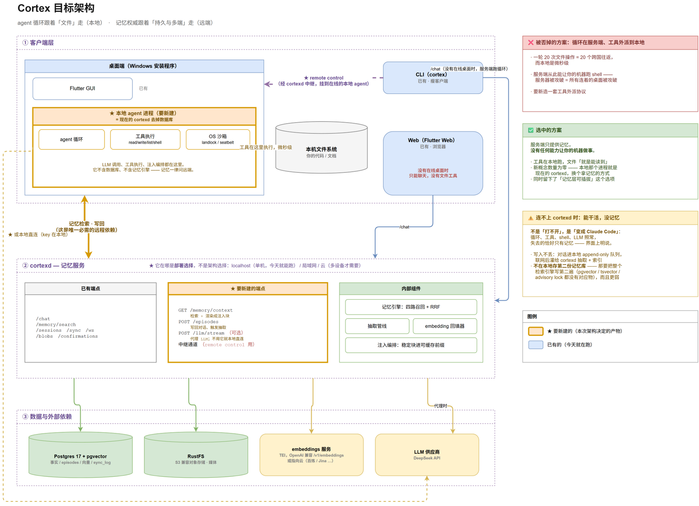
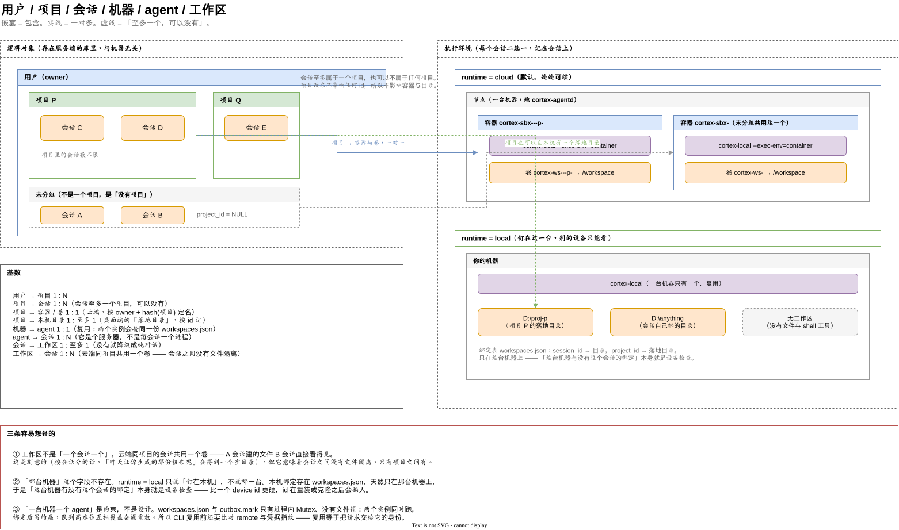

# 架构与技术选型

记录 Cortex 的架构决策、备选方案的否决理由，以及已知并接受的代价。

> 决策记录文档。目的是让将来的自己（或他人）知道**为什么**是这样，而不只是**是**这样。
> 相关：[参考项目](references.md)。[记忆系统设计](memory.md) 与
> [记忆体内容设计](memory-content.md) 描述的是 **Cormex** 那一侧，
> 2026-08-17 起本仓库不再连接记忆服务 —— 留着是因为那两份是它的设计史，
> 不是因为这里还在用。

---

## 一、总体架构



> 图源：[`assets/architecture.drawio`](assets/architecture.drawio)（drawio 可编辑）。
> **图画的是实况**，不是目标态 —— 上一版那张画的是「cortexd 一个进程什么都干」，
> 那个形态在 2026-08 的拆分之后已经不存在了。

### 一句话

**agent 循环跟着「文件」走，会话权威跟着「持久与多端」走。两者之间只有 HTTP。**

分层的依据不是「前端 / 后端」。循环该待在它要操作的东西旁边：编码 agent 一轮里
读几十个文件，那些文件在**你的机器**上；而会话要跨设备、要永久，那只能有
**一个**权威副本。两个「跟着走」的方向不同，所以它们分开。

> 这句话原来说的是「记忆权威」。记忆 2026-08-17 整个去掉了，而这条分层依据
> 与它无关 —— 换成会话之后成立的理由一字未变，这本身说明当初分层分对了。

### 三个进程，外加一个不属于本仓库的

| 进程 | 在哪 | 是什么 | 仓库 |
|---|---|---|---|
| **cortex-local** | 你的机器 / 沙箱容器里 | agent 循环、文件与 shell 工具、OS 沙箱、工具确认回路、断网 outbox。**没有数据库，也没有记忆引擎** | 本仓库 |
| **cortex-agentd** | 云端节点 | 按需拉起沙箱容器、逐字节反代进去、闲了回收。**唯一碰 docker 的进程** | 本仓库 |
| **cortex-egress-proxy** | 云端节点 | 沙箱网段是 internal 的，这是它唯一的出网口（CONNECT allowlist） | 本仓库 |
| ~~**Cormex（记忆服务）**~~ | ~~任何地方~~ | **本仓库 2026-08-17 起不再连它。** 它仍然是一个独立产品，只是这一侧没有任何一条路打过去了 | **另一个仓库**：[weironz/cormex](https://github.com/weironz/cormex) |

> **同一个二进制跑在两个地方。** 你机器上那个 cortex-local 与沙箱容器里那个是
> 同一份代码，差别只有一个 `--exec-env=container`。这不是巧合，是刻意的：
> 「派出去干活」与「改我本机的代码」如果各写一份循环，那就是两份实现，
> 而漏改的那一份不会有测试红 —— 那正是本仓库反复吃亏的形状。

### 已建 vs 还没有

这张表是本节的权威。

| | 状态 |
|---|---|
| 本地 agent 进程（cortex-local）| ✅ 已建。工具读写的是**你机器上**的目录 |
| 桌面端 / CLI 挂本地 agent，Web 挂容器里的那个 | ✅ 已建 |
| cortex-agentd 编排 + 沙箱容器 + 出网代理 | ✅ 已建 |
| Cormex 记忆服务（含 `/mcp` 对外门面） | ⚠️ 它自己在跑，但**本仓库不再连它**（2026-08-17） |
| 委托凭据（不受信调用方拿作用域绑死一个会话的短期钥匙） | ✅ 已建 |
| `flutter_rust_bridge` / Flutter 链接 `cortex-core` | ❌ **从未存在**，Flutter 侧纯 Dart |
| 客户端 SQLite 缓存 | ❌ 从未存在 |
| 长期记忆（转发抽取 / 召回注入 / `memory_search` 工具）| ❌ **2026-08-17 拆掉**。拆分后身份归 Cortex，转发被记忆服务回 401，三条路全断而提示词还在宣传它 |

### 注入块在哪渲染 —— 一条与上一版不同的定案

> ⚠️ **这一节记的是历史。** 长期记忆 2026-08-17 整个去掉了
> （`cortex_core::injection` 那个模块也删了），所以下面这条定案在本仓库已经
> 没有对象。留着是因为**那个论证与记忆无关**：任何「服务端渲染好文本再下发」
> 的接口都有同一个毛病 —— 格式漂移不报错。下一个想把渲染搬到服务端的人
> （比如生成侧的文档模板）该先读这一段。

上一版设计的是 `GET /memory/context`：服务端把记忆**渲染成块**再下发。
实际落地的是 `GET /memory/search` 下发**结构化结果**，由调用方自己渲染
（`cortex_core::injection::render_turn_block` / `render_profile_block`）。

这不是妥协，是发现「渲染好的块」当契约更糟：它把一段自然语言变成线上格式，
而**格式漂移不会报错，只会让效果变差**。下发结构化数据，两边各自渲染，
至少字段少一个是编译期错误。

⚠️ **但代价是真的，写在这里免得忘**：拆仓之后
`cortex-core/src/injection.rs` 在**两个仓库各有一份**（Cortex 这边给 agent，
Cormex 那边给 MCP），彼此没有任何编译期联系。今天两份的渲染实现逐 token 相同
（2026-08-15 核对过，剥掉注释与测试后完全一致），但没有任何机制保证它继续如此。
漂移的症状是**同一条记忆经 agent 看到的和经 MCP 看到的长得不一样** ——
不报错，只是两个通道的效果开始分家。

### 三条容易被图误读的说明

**① LLM 有两条路，代理不是唯一。** 默认经记忆服务的 `/llm/stream` 代理
（key 只在服务端一处，多设备不用每台配一遍）；也可以**本地直连**
（key 在本地 `.env`），适合想换模型 / 换供应商而不碰服务器的人。

**② 记忆服务在哪是「部署选择」，不是「架构选择」。**「记忆权威唯远端」里的
**「远端」是相对于 agent 进程说的，不是相对于你这台机器**：

| 部署位置 | 谁需要 |
|---|---|
| localhost（Cormex 那边 `just up` + `just run`） | 单人单机 |
| 局域网 / NAS | 家里几台设备 |
| 云 | 跨地点、手机也要用 |

**③ 分流在边缘，不在任何一个服务里。** dev 是 nginx，prod 是 traefik。
方向 2026-08-17 反过来了：**`/api` 默认进 agentd**，只有 `/api/memory`、
`/api/mcp` 与 `/api/health` 让给 Cormex（原来是「指名把 `/api/chat` 与
`/api/sandbox` 给 agentd」，而 0.1.10 把身份与会话全搬过来之后那条规则让整个
应用都在打记忆服务 —— 症状是登录时回一句英文 `no database attached`）。
细节与踩坑见 [deploy.md](deploy.md)。

让 Cormex 知道 agentd 在哪，等于给要独立开源的那一半留一条「agent 服务地址」
的配置，而独立部署它的人根本没有 agentd。

### 用户 / 项目 / 会话 / 机器 / agent / 工作区 —— 六者什么关系

上面那张图画的是**进程与依赖方向**。这一节画的是**运行时对象**：谁包含谁、
谁一对多。它是解释「409 为什么会出现」「为什么这个文件在那边看不见」时每次
都要重讲一遍的东西。



> 图源：[`assets/runtime-objects.drawio`](assets/runtime-objects.drawio)。
> 导出：`docker run --rm -v "$PWD/docs/assets:/data" rlespinasse/drawio-export
> -f svg --remove-page-suffix runtime-objects.drawio`（本机没装 drawio CLI 时
> 用这个；`<diagram>` 上**必须有 `id`**，否则它报 `missing field @id`）。

#### 基数

| | | |
|---|---|---|
| 用户 → 项目 | 1 : N | |
| 项目 → 会话 | 1 : N | 会话**至多**一个项目，也可以没有（`project_id = NULL`，叫「未分组」） |
| 项目 → 容器 / 卷 | 1 : 1 | 云端。名字是 `owner + hash(项目) 前 12 位` |
| 项目 → 本机目录 | 1 : 至多 1 | 桌面端的「落地目录」，**按 id 记、按名字建** |
| 机器 → agent | 1 : 1 | 复用已在跑的那个 |
| agent → 会话 | 1 : N | 它是个服务器，不是每会话一个进程 |
| 会话 → 工作区 | 1 : 至多 1 | 没有就降级成纯对话（`Turn::sealed()`，一个文件/shell 工具都不装配） |
| 工作区 → 会话 | 1 : N | 云端同项目共用一个卷 |

#### 三条容易想错的

**① 工作区不是「一个会话一个」。** 云端按 `owner + 项目` 分卷，所以同一个项目
下**所有会话共用同一个 `/workspace`** —— A 会话建的文件 B 会话直接看得见。
这是刻意的：按会话分的话，「昨天让你生成的那份报告呢」会得到一个空目录。
但它意味着**会话之间没有文件隔离，只有项目之间有**。

**② 「哪台机器」这个字段不存在。** `SessionRuntime::Local` 只说「钉在本机」，
不说钉在**哪一台**。本机绑定存在 `workspaces.json`，天然只在那台机器上，于是
「这台机器有没有这个会话的绑定」本身就是设备检查 —— 比一个 device id 更硬，
id 在重装或克隆之后会骗人。

> **这条后来兑现了，而且省掉了一整块工作。** 原先这里写着「谁在线谁都能连过去
> 必须先引入客户端设备身份」—— 做出来之后发现不必：名册里的 `machine_hint`
> 只用于找人与文案，路由的判据是**那个 agent 拿不拿得出这份绑定**。一个撒谎的
> 机器名在它声称能跑那一轮时当场被抓，而一个货真价实的 device id 在重装或克隆
> 之后仍然会骗人。少写一套设备身份，靠的正是这一段论证。

**③ 「一台机器一个 agent」是约束，不是设计。** `workspaces.json` 与
`outbox.mark` 只有进程内 `Mutex`、**没有文件锁**：两个实例同时跑，绑定后写的
赢，队列高水位互相覆盖会漏重放。所以 CLI 复用前还要比对 remote 与凭据指纹 ——
复用一个 agent 等于**把自己的请求交给它的身份**，指向别的服务端或登着另一个
账号的话，会静默读写别人的数据。

#### 目标态：把「地方」与「谁托管」拆开

现在 `runtime: Cloud|Local` 一个字段承担两件事：文件在哪、谁跑这一轮。而
`session_state.workspace` 是个**裸路径字符串**（`"D:\proj"`），不带机器 ——
「哪台机器」靠一个隐含约定解决：谁的 `workspaces.json` 里有这份绑定就是谁。
项目的本机落地目录**只存在客户端**，服务端根本不知道。所以**服务端今天没有
能力按工作区路由**，只能二选一。

拆开之后：

```
Workspace  { id, kind: ContainerVolume | MachineDir, machine_hint?, path, project_id? }
Agent      { id, machine_hint, kind, 能够到哪些 workspace, 版本, 心跳 }
Session    { …, workspace_id: Option<WorkspaceId> }      ← 不再有 runtime
```

一轮对话的路由变成一句话：**找一个在线且够得到这个会话工作区的 agent**。

这个方向调研过（[references.md](references.md)「远程挂载与多端」）：OpenHands V1
的 `Conversation` 工厂就是「workspace 决定循环在哪跑」，Codespaces 也是「工作区
一等 + 从任何地方挂」。**下面那条既有结论约束的是「同时」，不是「解耦」** ——
两家同样不允许一个会话同时在两个环境里跑。

阶段划分与三件明确不做的事，见 [roadmap.md](roadmap.md) 的 E 条。

#### 执行环境是会话身份的一部分

`SessionRuntime` 只有两档（`Cloud` 默认 / `Local`），而且**记在会话上**：
同一个会话在两端各跑各的话，两端指着完全不同的文件系统，用户在 A 端让 agent
写的文件到 B 端就「不存在」，而 agent 说的是实话。

调研过的四家（Claude Code / Codex / Cursor / OpenHands）没有一家允许同一个
会话在两端各跑各的。这也是那句 409 的来源：

> 这个会话绑在某台机器上的一个目录里，它的文件只在那儿。请到那台机器上打开它。

#### 远程接入：那句 409 现在有条出路

上面那条不变量**没有松动** —— 变的是「必须走到那台机器前面」这个代价。
那台机器可以显式同意被接入（`cortex-local --allow-remote-attach`，默认关），
之后 Web 上的这一轮由 agentd 转发给它：跑的还是那**唯一一份** agent 循环、
在那台机器的文件系统上，只有 UI 事件流跨了网络。

四件事值得单独记住，它们各自挡着一类静默故障：

**① 交给云端的不是入站凭据。** 本地 agent 的 `inbound_token` 能换出站凭据、
改 MCP 配置、把 agent 指向本机任意目录 —— 那是「拉起我的那个桌面端」的权限。
接入用的是另铸的一把钥匙，白名单四条路（`/health`、`POST /chat`、`GET /runs/*`、
`POST /confirmations`），其余默认拒。与沙箱那侧的委托令牌同一个形状，镜像到本地。

**② 那把钥匙从不下发。** 它只在心跳里出现，服务端留在内存的名册里；
下发给客户端的 DTO 里只有一个布尔 `attachable`。下发它等于让任何一台登录过的
设备直连别人的笔记本。

**③ 通告地址 ≠ 监听地址。** `--attach-addr` 单独给对外那个地址。
只用监听地址的话，NAT / 端口映射 / Docker Desktop 那个属于 WSL 的网关
三种情形下报出去的都是别人够不到的地址，而症状是名册里一行
「可接入」加上打不通 —— 所以拒绝 loopback 与通配符这条校验验的是**通告的**那个。

**④ 那句 409 分成三档。** 「在线但没开放接入」（附带怎么开）、「开了但连不通」、
「没有任何在线 agent 持有它」。合成一句的话，第一档的用户会去查防火墙，
而他要做的只是加一个启动参数。

#### 一个会话一次只跑一轮 —— 撞上时排队，不再丢话

两轮并跑同一个会话，它们写同一个工作区、往同一段历史追加，谁覆盖谁取决于时序。
这条不变量没变；变的是撞上的那一条怎么办。

原先回 409，代价是**用户敲的那句话就此消失**，而他往往正是因为看到「还在跑」
才补的那一句。现在它排队（流上先来一条 `{"type":"queued","ahead":N}`），
前面跑完接着答。OpenHands 在同一个问题上也是从「拒绝第二个客户端」改成 FIFO
（见 [references.md](references.md)）。

三处不显然的：

- **`POST /chat` 必须立刻返回那条 SSE**，哪怕前面还有一轮。按住请求等前面跑完
  的话，中间的反代（dev 的 nginx、生产的 traefik）会先在读超时上把它掐掉 ——
  于是一次本该成功的排队在客户端表现为「网络错误」
- **排队要说一声。** 那条流在轮到自己之前只有 keepalive，界面上与卡死一模一样
- **闸门的许可要持有到这一轮彻底结束**（含 episode 落库）。提前放开等于让下一轮
  开始读历史，而那时上一轮的结果还没进去 —— 症状是「它没听见我上一句说的」

顺序由 tokio 信号量的 FIFO 公平性保证，不是手写队列：那正是最容易写出
「偶尔插队」的地方，而插队在屏幕上的样子是「模型答了上一个问题」。

#### 云端纯对话也会起容器

`/chat` 对 `Cloud` 会话**无条件**起（或复用）容器再把整个请求转进去，没有
「这一轮不需要工具就地跑」的岔路。原因是 agentd **没有 agent 循环**（它连
`cortex-agent` 那个 crate 都不依赖），循环只存在于 `cortex-local`。

实测代价很小，所以不打算改：空闲沙箱容器 **3.4–22.8 MiB**（cgroup 上限是
512m，那是上限不是占用）、空闲 CPU **0.00–0.01%**、工作区卷 92–156 KiB、
切项目冷启动 **913 ms**。

加一条「宿主侧就地跑」的路等于让同一个 `Turn::run` 有两处装配，而这个仓库为
这件事付过两次代价：记忆服务里那份第二实现（删掉的理由不是它有 bug，而是
**漏改的那一份不会有任何测试红**）、以及 2026-08-17 那个「沙箱里每条命令都没
有网」（网络策略分散在两个构造函数里）。拿一类静默故障去换 3 MB 不划算。

**该盯的不是容器数量，是那四个数** —— 项目数破百之后重测。

### CLI 与 Web 现在到底能做什么

| | CLI | 桌面 GUI | Web |
|---|---|---|---|
| 渲染工具事件、答工具确认 | ✅ | ✅ | ✅ |
| **操作你机器上的文件** | ✅ 走本机 cortex-local | ✅ | ⚠️ 默认走**云沙箱**里的 `/workspace`；那台机器开了 `--allow-remote-attach` 时可以真的挂上去 |
| 上传 / 下载附件、图片理解 | —— | ✅ | ✅（图片理解取决于**选中的模型**看不看得懂图，不需要任何环境变量） |
| 输出代码（markdown + 高亮） | 终端原样 | ✅ | ✅ |
| 文件改动 diff | ✅ | ✅ | ✅ |
| 生成图片 / 生成 Word·PPT·Excel | ❌ | ❌ | ❌ |
| 终端 ANSI | ❌ | ❌ | ❌ |

**与 ChatGPT / Claude 的真实差距在生成侧**（图片、文档），不在接收侧。
接收那一半已经不差了。

### 否决记录：为什么不是「循环在服务端 + 工具外派到本地」

那个方案看起来更「统一」（一份循环、Web 端也能用文件工具），**否掉**：

1. **延迟**：一轮 20 次文件操作 = 20 个跨国往返，而本地是微秒级。
   编码 agent 的一轮动辄几十次 IO
2. **信任模型倒退**：服务端从此**能让你的机器跑 shell**。服务器被攻破
   = 所有连着的桌面被攻破。而循环在本地时，服务端只提供记忆，
   **没有任何能力让你的机器做事**
3. 要新造一套工具外派协议

> ⚠️ **「派 agent 去云上干活」这件事没有被否掉，但它的实现方式换了。**
>
> 上一版这里写着「服务端那条循环连同 `Live::workspace_turn`、会话绑定工作区
> 留着」。**那条循环已经删了**（它是记忆服务里的第二份 agent 实现，
> 漏改的那一份不会有测试红）。
>
> 能力没有消失，换了个宿主：现在是 **cortex-agentd 拉起一个容器、里面跑
> 同一个 cortex-local**。也就是说「派出去」与「在本机跑」共用一份循环，
> 而不是两份。
>
> | 场景 | 走哪条 |
> |---|---|
> | 改我本机的代码 / 文档 | 本机 cortex-local |
> | 派出去干活，关掉笔记本也照跑 | 容器里的 cortex-local（agentd 拉起）|
> | 没有在线桌面时随便聊两句 | 同上 |
>
> 要补的只有产品化的部分：给它一个明确的入口（「派出去」而不是碰巧绑了工作区）、
> 任务状态可见、跑完通知。**不是新架构。**
>
> **这里有个我们独有的东西**：派出去的 agent 与你共用**同一个记忆权威**。
> 它在云上学到的东西直接进你的记忆，回来不用「汇报」——
> Devin 那类云 agent 的产出是一个 PR，学到的过程随容器一起消失。

### 否决记录：为什么不在本地存第二份记忆库（SQLite）

「离线也能召回」很诱人，但它**不是「加一个本地库」，是把整个检索引擎写第二遍**：

| 要在本地重做的 | 现在依赖什么 | SQLite 上的对应物 |
|---|---|---|
| 向量召回 | pgvector `<=>` + HNSW | 无原生向量索引 |
| BM25 那一路 | Postgres `tsvector` + jieba | FTS5，**另一套分词与打分** |
| 融合 / 去重 / 回放 | `DISTINCT ON`、递归 CTE、`active_facts` 视图 | 全部重写 |
| 提交顺序 | `pg_advisory_xact_lock` | 无 |

而第二遍必然更弱（分词不同、没有 HNSW），后果是**离线时检索质量悄悄地不一样** ——
本项目一路在防的正是这类失效。更何况离线时算不出 embedding、也调不了抽取用的 LLM，
新写的东西根本进不了语义空间。

> **补一条对更早那一版理由的更正**：它把否决理由写成「两个真相源会打架」。
> 那条其实**站不住** —— 全链路 append-only、每行带 `device_id`、`sync_log` 是 outbox、
> 失效靠追加 `fact_events`，这套设计本来就是为多写者准备的。真正挡路的是上表那个
> 工程量，以及「第二个引擎更弱且静默」。理由写错会让将来的人用错误的前提去推翻它。

真要离线完整可用，答案是**把记忆服务跑在 localhost**，而不是写个 lite 版。
但那条路上有个现在**没有**的东西：那样会变成两个记忆服务要互相同步，
而 `sync_log` 是**服务端 → 客户端**的单向拉取，**没有服务端之间的多主同步** ——
那是独立且不小的设计问题（冲突、因果序、双向游标），不是配置能解决的。

**连不上记忆服务时是「变成 Claude Code」，不是「打不开」。**
循环、工具、shell、LLM 照常，失去的**恰好只有记忆** —— 界面上明说了。
写入不丢：对话进本地 append-only outbox，联网后灌回去抽取 + 索引。

### 已被评估并否掉的顾虑

外部评审反复提到的四条，核过代码后**前提不成立**。记在这里免得再提一遍：

| 顾虑 | 实际情况 |
|---|---|
| 「每次工具调用都要远程查记忆，RTT 会成瓶颈」 | 记忆检索是**每轮对话一次**，不是每次工具调用。一轮 = 「取记忆 + 写回」两次 RTT。**建议的「批量异步写回」刻意不做** —— append-only 的「写入不丢」要求写及时，攒着批量正是丢数据的形状 |
| 「读了大文件会把大量文本传回服务端」 | 工具输出的**原始字节已定案不存**（`cortex_memory::trace::safe_text` 负责剪掉）。进记忆的只有 `name / path / ok / summary` |
| 「Windows 缺沙箱，工具会裸奔」 | 方向反了。`Capability::Unavailable` 时**默认拒绝执行**，除非把 `CORTEX_SANDBOX=unsandboxed` 显式写进环境。见下面「Windows 上跑不了命令」 |
| 「`/llm/stream` 代理会泄露 API key，应当移除」 | **key 本来就必须在服务端** —— 抽取要调 LLM，这与代理无关。移除代理不会让 key 离开服务器。留一条本地直连的理由是**配置便利**，不是安全 |

### ⚠️ Windows 上跑不了命令 —— 两个决定的直接冲突

- 桌面安装程序**只发 Windows**（理由是 SmartScreen 是警告而 Gatekeeper 是硬拒绝）
- 而 Windows **没有** landlock / seatbelt 的对应物，`Capability::Unavailable`

**影响范围**（2026-08-08 在 Windows 上实测；更早的版本把它写大了，
说成「一个文件都不肯写」，那是错的）：

| | Windows 上 | 为什么 |
|---|---|---|
| 文件读 / 写 / 列目录 | ✅ 正常 | `ToolSandbox::resolve` 的围栏是纯路径逻辑，不依赖内核 |
| `shell` 执行命令 | ⚠️ 要人确认 | 本地那侧把 `Risk::Execute` 接到了已有的确认回路 —— 换一种保证：**人在场** |

远端触发的执行没有「人在场」这个前提，所以**容器那一侧不走这条路**：
沙箱容器里越界路径直接拒绝，不问。

### 拆成两个进程带来的四类新问题 —— 各自是怎么解决的

上一版把这四条列为「将会出现的问题」。它们都出现了，也都处理了；
留在这里是因为**处理方式本身是决策**：

| 问题 | 现在怎么办的 |
|---|---|
| **版本兼容** | `cortex-proto::PROTOCOL_VERSION` + 启动时 `check_peer` 握手。不兼容时**拒绝启动并说清该升哪一边**，不降级运行 |
| **进程健壮性** | 本地 agent 崩了由桌面端自动拉起（不必重启整个 GUI）；容器那侧由 agentd 的 reaper 管生命周期 |
| **会话执行状态 ≠ 记忆** | 定案：**不同步执行上下文**。`confirm.rs` 早就对「待确认项」做过同类裁决 —— 刻意不落库，因为进程一重启那一轮的循环与挂起的 future 都没了，此时数据库里一条永远等不到人的待办比不写更糟 |
| **工作区绑定** | 改成**设备本地**状态（不再是服务端会话字段）。记忆服务那边的 `workspace_patch` 现在只接受「解绑」，绑定一律拒绝并说明两条路各是什么 |

> 顺带一条**今天仍然成立**的性质：**抽取是异步的**。
> 所以刚说过的话不会立刻出现在记忆里。实际影响小 —— 同一会话内对话历史
> 本身带着上下文，注入是给**跨会话**召回用的 —— 但这是个应当知道的性质，
> 不是缺陷。

### 与 goose 的关系

进程形态同构（`goosed` 独立进程 + UI 壳），但仅此而已 —— goose 的存储是单机
SQLite 且**没有任何实例间同步**，同步机制为 Cortex 独有，无先例可循。

---

## 二、技术选型

### 核心语言：Rust

**理由**

- 同一份 `cortex-core` 被服务端与各客户端共同链接，业务逻辑只写一遍
- 记忆检索（混合召回 + 融合排序）是每轮对话都要走的计算密集路径
- cortexd 是常驻守护进程，这是 Rust 的主场

**代价**：prompt 与上下文策略需要大量试错，Rust 的编译等待会拖慢这个循环。

---

### 服务端：axum

Tokio 官方出品，Rust 服务端生态最主流。搭配 `sqlx`（数据库）、`aws-sdk-s3`（对象存储）、`reqwest` + `eventsource-stream`（LLM 调用）。

---

### 数据库：PostgreSQL + pgvector

**理由：一个组件覆盖四路召回中的全部**

| 召回路径 | PG 中的实现 |
|---|---|
| BM25 全文 | `tsvector` + GIN |
| 向量余弦 | `pgvector` HNSW |
| 图遍历 | 递归 CTE / 邻接查询 |
| 时间近因 | B-tree |

加上事务、JSONB、`sync_log` outbox（同步的唯一事实序，见 memory.md §四/§九）。**少一个组件就少一份运维与一致性问题**——对一个人做六端而言，这是决定性的。

**否决的备选**

| 方案 | 否决理由 |
|---|---|
| **TiDB** | 面向 TB 级水平扩展，而本项目瓶颈是**检索质量不是数据量**；最小部署需 PD+TiKV+TiDB 多组件，自托管过重；MySQL 系全文检索弱，中文尤甚；向量生态远不及 pgvector |
| SQLite + sqlite-vec | 服务端多客户端并发写不足（**客户端缓存层仍使用它**） |
| Qdrant / Milvus | 向量性能更强，但多一个组件，结构化数据仍需 PG。千万级向量以下不划算 |
| Neo4j / FalkorDB | 图结构已由 `facts` 表的邻接关系承载，无需图数据库 |
| ClickHouse | 分析型，不适合 OLTP + 检索混合负载 |
| LanceDB | Rust 嵌入式向量库，方向有趣但生态尚早 |

**何时该换**

- 向量超过约 1000 万条 → 引入专用向量库
- 需要跨地域多主写入 → 才轮到分布式数据库

按当前索引策略（向量只覆盖 facts / 摘要 / 媒体转录，不覆盖 L0），十万级对话对应的向量约在几万至几十万条量级，距触发线尚有两个数量级。

---

### 对象存储：RustFS（S3 兼容）

**理由**

- Rust 实现，与技术栈一致；Apache-2.0，无 MinIO 的许可证包袱
- 已验证支持 multipart upload（视频）、presigned URL（客户端直传，不经 cortexd 中转）、range/conditional read（音视频拖动播放）
- 自托管，数据主权

**为什么不能只用 Postgres 存二进制**

| 问题 | 后果 |
|---|---|
| WAL 放大 | 每写一个视频都进 WAL，备份与复制成本暴涨 |
| 备份时间 | `pg_dump` 装满视频的库慢到不可接受 |
| 内存污染 | `shared_buffers` 被大对象挤占 |
| 无 range 读取 | 视频拖动播放需要 HTTP range |
| 无 presigned URL | 手机传视频时带宽翻倍 |

**接入注意**

- 必须设 `force_path_style(true)`——RustFS 默认仅支持 path-style 寻址。
  **不设时的症状与环境有关**（实测）：有的环境是 `bucket.host` DNS 解析失败；
  Windows 上 `cortex-blobs.localhost` 会解析到 127.0.0.1，TCP 连上后被 RustFS
  关闭，报 `connection closed before message completed`。
  **两种报错都不含桶名、也不提寻址方式，看起来都只是普通网络故障**——
  这正是它难查的原因。`cortex-blob` 里有不依赖网络的单测钉住这一行为
- **纠删码要求四块独立物理盘**。`RUSTFS_VOLUMES=/data/rustfs{0...3}` 若落在同一块盘上是假冗余，
  RustFS 会检测到共享设备并拒绝启动（已实测）。因此：
  - 开发环境：单卷 `/data` + `RUSTFS_UNSAFE_BYPASS_DISK_CHECK=true`
  - 生产环境：四卷挂真实独立磁盘，`RUSTFS_UNSAFE_BYPASS_DISK_CHECK=false`
- 保持 `RUSTFS_DURABILITY_MODE=strict`
- RustFS 无按桶的 CORS 接口，允许来源是**服务级**配置（`RUSTFS_CORS_ALLOWED_ORIGINS`）。
  Flutter Web 走 presigned PUT 直传时需要放开
- 不支持对象版本控制，但**无妨**——blob 以 SHA-256 为 key，对象天然不可变，永不被覆盖
- 存储层封在 `BlobStore` trait 后，只用标准 S3 API，将来换 R2 / MinIO / AWS S3 零成本
- **RustFS 处于 alpha**（社区已有 disk-full 元数据损坏不可恢复的实录）。配套要求：磁盘用量 85% 硬告警、
  备份镜像先行（见下节）、trait 保留退路——接受它可能在 v1 周期内出事

---

### 全部图形界面：Flutter

**桌面 ×3 + 移动 ×2 + Web，六个平台一套 UI 代码库。**

**理由**

1. **RustDesk 是同架构的最强生产验证**——Rust 核心 + Flutter UI，五端全覆盖，119.8k 星，持续活跃
2. **技术栈最少**：Flutter + Rust 共两个。一个人做六端，认知负担是首要约束
3. **移动端原生生态成熟**：相机、录音、后台上传、推送均有生产级方案。移动端定位为"随手拍照录音进记忆"，最依赖这些
4. **自绘渲染，不依赖任何系统组件**，六端行为一致
5. 已有实践经验

**否决的备选**

| 方案 | 否决理由 |
|---|---|
| **Tauri v2** | **依赖系统 webview**——Linux 上是 WebKitGTK，各发行版版本参差，行为不可控。且最大的 Tauri 项目（Clash Verge 135.9k）恰恰**只做桌面**，移动端缺乏大体量验证 |
| **iced** | **没有移动端**（实验性）。选它等于桌面移动各写一套 |
| **Electron + React** | 富文本白送，但需背三套技术栈、桌面端 ~150 MB、内存高。且**并不能免除手搓**——移动端仍用 Flutter，markdown 渲染还得再写一遍 |
| gpui（Zed） | 独立使用文档少；Zed 是文本重、媒体轻的编辑器，与本项目的富媒体需求不符 |
| Compose Multiplatform | 技术上可行，但需学 Kotlin，Rust 集成走 JNI 比 flutter_rust_bridge 麻烦 |
| egui / slint / makepad | 富文本与媒体能力不足；slint 为 GPL/商业双许可 |

**关于 Flutter Web**

官方明确将 **SPA 与"已有 Flutter 移动应用"**列为适用场景。本项目 Web 端是登录后使用的私有 SPA，不需要 SEO，正落在适用区。

---

### Rust ↔ Flutter：flutter_rust_bridge

MIT，活跃维护。这是**工业界标准做法**——Rust 做核心库、UI 用成熟框架，Signal / Firefox / 1Password 同路。Mozilla 的 `uniffi` 是同类工具的另一选择。

Rust 在移动端**没有**成熟的原生 UI 框架，不应尝试用 Rust 写移动界面。

---

### Embedding：bge-m3 / 1024 维，本地 ONNX 运行

**理由**：多语言（中英文均强）、8192 token 长文本、开源可本地运行（**记忆内容不出网**）、1024 维是表达力与内存占用的平衡点。

所有向量表记录 `embedding_model` 字段，支持换模型时渐进回填、不停机迁移。详见 [memory.md §七](memory.md)。

**部署预算**：默认 **int8 量化** ONNX（fp32 约 2.2 GB / int8 约 600 MB，8 GB 内存机器上 int8 是必选项）；
交互 query 用 batch=1，后台回填用大 batch。低配 VPS（2 vCPU）单条 query 实测可达 ~700 ms，
应在部署文档写明最低推荐配置；后台管道（转录+抽取+embedding）需带积压深度指标与「处理中」状态展示，
静默滞后会毁掉移动端「随手拍照录音进记忆」的体验。

---

### 中文分词：Rust 侧 jieba-rs

PostgreSQL 默认不支持中文分词，`to_tsvector('simple', ...)` 对中文近乎失效，会直接废掉四路召回中的 BM25 那一路。

**不选** `zhparser` / `pg_jieba` 扩展的原因：依赖数据库能安装扩展。当前自托管无碍，但将来若迁移到托管 PG（RDS / Supabase / Neon）大概率装不了，届时迁移极痛。

**采用**：Rust 侧用 `jieba-rs` 分词，拼成空格分隔词串后写入 `tsvector` 列。零扩展依赖，分词逻辑可控，换分词器只需重跑一遍。

---

### LLM 供应商：自定义规范消息格式 + 适配器

不绑定任何供应商，可自由切换。

**不采用最小公倍数式的抽象**（如 LiteLLM 风格）——那会丢掉两样最贵的东西：

| 特性 | 若被抽象掉的后果 |
|---|---|
| **Prompt caching** | 三家语义完全不同（Anthropic 显式 `cache_control`、OpenAI 自动前缀、Gemini 显式 context caching）。抹平后**长 agent 循环成本上涨 5–10 倍** |
| **推理/思考块** | Anthropic extended thinking、OpenAI reasoning item 必须原样回传，否则多轮行为退化甚至报错 |

因此内部消息格式必须能**无损承载供应商特有的不透明块**，缓存是一等公民而非适配器内部细节。

参考：codex 的 `protocol` 与 `model-provider` crate、goose 的 `goose-providers` crate。

---

### 架构模式：daemon-first

**理由**

- Postgres 单写者，多端并发直连必然锁冲突
- Embedding 模型常驻共享——每客户端加载一份数百 MB 是灾难
- 后台任务（事实抽取、媒体转录、记忆整合）不应阻塞对话
- 跨端连续性：CLI 里聊的，桌面端立刻可见

**验证**：codex 的 `app-server` / `app-server-daemon` / `app-server-protocol` 与 goose 的 `goosed` 均为此形态。

> 此决策必须在第一天确立。后期从嵌入式改为 daemon 是伤筋动骨的重构。

---

### 数据模型：全链路 append-only + ULID

无 `UPDATE`、无 `DELETE`（唯一例外见 [memory.md §十一](memory.md) 的 `redact`/`purge`）。

- **无冲突**：多端并发写天然无冲突，同步退化为面向 `sync_log` 的单游标增量拉取（memory.md §九），无需 diff、无需三方合并、无需 CRDT
- **ULID 主键**：客户端可离线生成，全局唯一且时间有序，无需中心发号器
- **消灭应用层删改路径**：系统中不存在销毁数据的常规路径。注意这不等于物理持久性——「永不丢失」由备份体系兑现（见下）

---

### 客户端本地存储：SQLite，仅作缓存

**不是真相来源。** 真相在远端 cortexd。

本地 SQLite 的职责：检索缓存（避免每轮对话走网络带来 200–500 ms 延迟）、离线写队列。

---

### 备份与灾备 —— v1 发布门槛

「永不丢失」的物理层兜底。append-only 防不了磁盘损坏、存储软件 bug、误 `DROP`、勒索、整机丢失；
**本地同步副本不算备份**（purge 与损坏会随同步传播）。

| 组件 | 方案 |
|---|---|
| Postgres | pgBackRest / WAL-G：每日全量 + 持续 WAL 归档（`archive_timeout=60s`，分钟级 RPO 的 PITR）；备份目标是**独立于主 RustFS 的第二存储**；每周额外 `pg_dump` 逻辑备份；`initdb` 即开 `data-checksums` |
| RustFS | `rclone` **不带 `--delete`** 增量镜像到第二 S3；key 即 SHA-256 自带校验；purge 由 `redactions` 表驱动显式删除镜像对象 |
| 对账 | 以 `blobs` 表为权威清单，定期对账主存储与镜像 |
| 演练 | **每月脚本化恢复演练——没演练过的备份等于没有备份** |

---

### 供应商层：取件，不是依赖

`crates/cortex-providers/` 取件自 goose（Apache-2.0），**此后由 Cortex 自行
维护，不与上游同步**。

原先是 crates.io 上的 `goose-providers = "0.1.0-alpha"`。三个理由让它改成取件：

1. **它是 alpha。** alpha 可以被 yank，API 会变。靠 `Cargo.lock` 钉着今天是
   稳的，但任何一次升级都是赌 —— 而这一层是整条链路上最不能出意外的部分。
2. **我们用不到它的大半。** 上游 30k 行里 databricks / snowflake 那几套本仓库
   一行都执行不到（连供应商定义都没有），却一直在编、一直占二进制体积。
3. **仓库自己的纪律本来就这么写。** CLAUDE.md 第一条：「供应商适配、
   apply-patch、沙箱这类繁琐但已被工业验证的部分**一律取件**」。

取了 ~19k 行 + 3 MB 模型目录；砍的判据只有一条：**有没有一条真实调用链能
到达**。「以后可能会用」不算 —— 那种理由留下的代码没人验证过。

不留「定期同步 upstream」的流程是有意的：一个没人会执行的流程比没有更糟，
它会让读代码的人以为这里的改动需要先跟谁对齐。保留署名是 Apache-2.0 第 4 条
的要求，与「这是不是我们的代码」无关。

**加一家供应商通常只要加一个 JSON**（`cortex-llm/src/definitions/`），只要那家
讲 openai / anthropic / ollama 里的一种协议。Gemini 是唯一的例外：它讲第四种
协议，走 `cortex_providers::google` 的专用实现 —— 走它的 OpenAI 兼容端点能
省掉这个分支，但那条路**透不出 thinking 块**，而那正是不可违反约束第 3 条
点名不许丢的两样之一。

---

### 模型选择：目录说「能干什么」，定义说「能不能用」

两个来源，各回答一半，缺一不可：

| | 谁说了算 | 回答什么 |
|---|---|---|
| 模型目录（`cortex_llm::catalog`） | models.dev，编译期嵌入的 5184 条 | 上下文多长、支不支持工具、能不能看图/生图、多少钱 |
| 供应商定义（`definitions/*.json`） | 我们自己 | **这个部署真的调得通哪些** |

只用目录的话，选择器里会出现这个部署根本没开通的型号，选完之后每一轮对话
都失败，而错误来自供应商、看不出是选错了。只用定义的话，每个模型旁边都是
空白 —— 而「这个模型支不支持工具调用」恰恰是最要紧的一位。

**`tool_call` 是这张表里唯一会造成静默失败的字段**：不支持工具的模型跑
agent 会流畅地回答而一个工具都不调，用户只会觉得它「不听话」。所以它在
界面上是硬拦，而不是提醒。

而 `null`（目录里查不到）与 `false` **必须画成不同的东西**：把「不知道」当成
「不行」会把一个能用的模型挡在外面；当成「行」又会让人踩上面那个坑。

#### 「自动」档挑的是什么

实现：`cortex-agentd/src/model_pick.rs`（判据）+ `llm.rs::resolve_auto`（跨来源）。
**逐轮**算，不是选一次定终身。

它挑的不是「最优」，是**够用里最便宜的**。判断哪个模型对某个具体问题答得
更好，需要一个评测集与一个判定器，两样都没有 —— 编一个「智能路由」出来，
用户会以为难题被送去了强模型，而实际分派依据是我们瞎写的。界面文案因此
只写「在能干这活的模型里挑最便宜的」，而实现与这句话逐字对应。

这仍然有价值：绝大多数轮次不需要旗舰模型，而「装不装得下、够不够用」正是
人不愿意每轮手动判断的事。一句「这个函数干嘛的」和一次「把这三个文件重构
掉」，前者用廉价档没有区别，而价差是十倍。

**第一步：这一轮长什么样**（`TurnShape::of`）

| 读出什么 | 怎么读 |
|---|---|
| 带没带工具 | `tools.len() > 0` |
| 有没有图 | 消息里有没有 `MessageContent::Image` |
| 输入大概多少 token | 字符数 ÷ 3 + 每个工具定义 200 |

⚠️ 长度**刻意估大**（中文一个字常常就是一个 token 甚至更多，图片按 1500
一张的保守常数算）。估小的后果是挑了个装不下的模型，而那一轮会被供应商
拒掉在**字已经吐给用户之后**；估大只是少用了一个本来也能用的便宜模型。
两个方向代价不对等。

**第二步：硬性排除**（`TurnShape::fits`）

| 这一轮 | 排除掉 |
|---|---|
| 带了工具 | `tool_call != Some(true)` |
| 消息里有图 | `vision != Some(true)` |
| 任何一轮 | 上下文装不下「输入 + 8000 token 回答余量」的 |

余量那一条不能省：上下文是输入与输出共用的，顶着输入上限挑会让模型没地方
写答案 —— 而那种失败发生在流已经开始之后。

**第三步：比价**

按「一次典型调用」算（实际输入长度 + 1000 token 输出），不是只比输入价 ——
输出通常比输入贵好几倍，只比输入会挑中一个输出极贵的。

两种候选**直接跳过，不是当成便宜**：查不到价目的、以及目录里根本没有的
（后者必然也没有价目）。当成 0 的话，一个我们一无所知的模型会稳赢每一次。

⚠️ 由此有一个读起来像 bug 的行为：**光按能力覆盖开关救不活一个目录不认识
的模型**。用户在「编辑模型」里说了它能看图、能调工具，自动档仍然不选它 ——
因为不知道它多少钱，而这一档的全部意义就是比价。他**指名**选它照常能用。

**第四步：跨来源**（`resolve_auto`）

候选是「部署那条 + 全部启用的自带来源」，每条各挑出自己的赢家再比一次。

⚠️ **部署那条只有「此刻还用得了」才算候选** —— 总开关开着，且这个人的配额
没超。少了这道判断的后果 2026-08-26 实地撞到：部署那条通常最便宜（同价时
还优先它），于是自动档稳稳挑中它，然后吃一个 429「这个月的用量已经用完
了」—— 而用户手上有三条自带 key 的来源，每一条都走得通。他开自动档要的就是
「你替我挑一个能用的」，我们却挑了唯一一个不能用的。

但**没有别的来源时仍然落回部署那条**，让下游那道闸去报错：那句话说得出超了
多少、什么时候恢复、怎么继续，而在挑模型这一步回一个「挑不出来」，用户拿到
的是一句泛泛的失败，真正的原因一个字都不会出现。
只在用户碰巧选中的那条来源里挑，等于把自动档降级成「这条来源里最便宜的」
—— 而一个人配自己的 key 多半就是为了便宜或者为了某个更强的型号。

同价时**部署那条赢**（它排在候选表最前，比较用严格小于）：没配过 key 的人
的行为不该跟着「他碰巧加过一条同样的来源」变。

顺带一个真实的好处：跨来源经常会挑到用户自己那把 key —— 那一轮因此不占
配额，而这正是他配 key 的理由。

**挑不出来时回落到部署默认 + 一条 WARN**，不报错。用户开着自动档而这一轮
恰好没有模型装得下，报错等于让他什么都做不了；回落至少给供应商一个机会
（它的真实上下文可能比目录记的大）。WARN 让运维看得见「自动档在这个部署
上挑不出东西」。

**能力从哪来：四级回落，与另外三处同一份**

`fits` 读的不是目录，是 `cortex_llm::caps::resolve`（手动覆盖 > 接口探测 >
models.dev 目录 > 供应商定义）。读同一份的一共**四处**：设置页、聊天的模型
选择器、发送闸门 `ensure_can_see`、以及这里。少喂给其中任何一处都不报错，
症状是同一个模型在两个界面上说两句话 —— 2026-08-26 一天里犯了三次。
详见 [roadmap.md](roadmap.md) 那一节与 `model_sources::SourceCaps`。

⚠️ **这里「不知道」= 不选，与发送闸门的三态故意相反。** 闸门放行 `None` 是
因为那个模型是**用户自己选的**，我们不知道它行不行，没有立场替他拦下；
自动档挑的是**我们**，在一堆有确凿把握的候选里挑一个心里没底的，出了事是
我们替他选错了，而排除它的代价只是这一轮少一个候选。

**只有一份实现。** `resolve_auto` 在 `stream` 最前面就把 `Auto` 就地解成
`Named(...)` 或 `Deployment`，下游再也见不到自动档。`resolve_model` 里从前
有第二份（只在部署那条的白名单里挑、只看目录），它靠「反正走不到」维持
正确 —— 而那种正确没有任何东西守着，已经删了。

#### 设置页按「问题」分节，不按「控件」堆叠

模型这一页原先是一串平铺的选项：六个单选按钮（跟随部署 / 自动 / 四个型号），
紧接着「自己的 API key」，再接着「本机模型」。用户的原话是
**「上来就给四种选择，太难理解了」**。

他没看错 —— 那四项看起来并列，实际回答**三个不同问题**：

| 问题 | 谁回答 | 与其他节的关系 |
|---|---|---|
| 用哪个模型 | 跟随部署 / 自动 / 指定一个 | 三选一，互斥 |
| 谁的账户付这笔钱 | 服务端那把 key，还是你自己的 | 与上面正交 |
| 没有网的时候打给谁 | 本机模型 | 与上面两个都正交 |

平铺的问题不在「选项多」，而在**读者无从知道哪些是互斥的**：「自己的
API key」看着像第四个模型选项，可它跟选哪个模型毫无关系。分节之后，
同一节里的东西互斥、跨节的东西正交，这件事不用解释就看得出来。

顺带把第一节收成一行（当前是什么 + 「更改」）：铺开六个单选项会让它的
体积是另外两节的三倍，于是它像「主菜单」而后两节像它的下级。

**Web 与桌面是同一个视图**，只有第三节例外 —— 它在 Web 上**整节消失**，
因为浏览器里没有本地 agent，那份配置存了也没有任何东西会读它
（`local_llm_store_web.dart`）。这不是「Web 少一块功能」，是那里根本不存在
这个问题；显示一个没人读的控件比不显示更糟。

#### 选择器在撰写框上，不(只)在设置里

模型 chip 与工作区、权限档并排在输入框下方。换模型是**逐轮**的决定 ——
「这一句用哪个」，不是「我这个人的偏好」；埋进设置意味着每次想换都要
开窗、找页、关窗，而真实用法是问一句便宜的、下一句换个贵的。

设置里那份（`ModelPickerTile`）留着，它带价目表与能力说明，服务的是
「我要挑一个」的场景。两处读写的是**同一个** `selectedModelProvider` ——
一个功能两份状态的表现是「chip 上显示 A、设置里显示 B，发出去的是其中一个」。

⚠️ 面板的返回值包了一层记录（`({String? id})`）。直接回 `String?` 是错的：
「跟随部署」这一项要回 `null`，而点面板外关掉给到的也是 `null`，撞车的表现是
**误触一下就静默退回默认模型**，而用户不知道自己改过什么。

#### 模型来源：一份可增删的列表，取代三个概念

用户的要求：**「第一步都是添加模型，不分云端本地，离线在线」**（参照
Cherry Studio 的「模型服务」页）。

在它之前这里是**三个概念、三套存储**，而它们结构上完全一样
（`{provider, key, base_url}`）：

| | 存哪 | 谁读 |
|---|---|---|
| 跟随部署 | 服务端环境变量 | agentd `st.llm()` |
| 自己的 API key | `llm_keys` 表（**单槽**） | agentd `own_key()` |
| 本机模型 | 系统凭据库 | 本地 agent（启动时注入环境变量） |

**这个割裂是会咬人的**，2026-08-19 在 dev 上实测：自带 key 是 alibaba、
部署是 deepseek，于是 `/llm/models` 列 deepseek 的型号、`/llm/stream` 拿
alibaba 的白名单去校验 —— 三档里两档是坏的（「跟随部署」把
`deepseek-v4-pro` 这个名字发给 DashScope，「指定型号」选什么都 400）。
只有「自动」碰巧对，因为它本来就从当前 provider 的列表里挑。

根因是「模型跟部署走、key 跟用户走」。**一条来源必须自带它的模型列表** ——
选一个模型才有唯一确定的 key 与端点。表是
`migrations/20260820000001_model_sources.sql`，路由在
`crates/cortex-agentd/src/model_sources.rs`。

部署那条也在列表里（`builtin`）：只读、不可删，但**能关**。藏起来的话一个
零配置就能聊的新用户会以为自己什么都没有；不给关的话，一个自带 key 的人
没办法阻止某些对话去花服务端的钱。它是唯一 `free_of_quota = false` 的 ——
那正是配额存在的理由。

##### ⚠️ 「能关」这句话曾经是假的

上面那句从写下那天起就在文档里，而代码里 `upsert` 对
`DEPLOYMENT_SOURCE_ID` 是**整个拒绝**的 —— 界面上那个总开关点下去回一句
「非法输入」再弹回原位。同一条来源上每个型号的开关更糟：客户端里是
`if (s.builtin) return;`，**静默什么都不做**。2026-08-21 用户报的就是后一个。

根因是那条来源**没有行**（环境变量配出来的），于是任何「用户对它做过什么」
都无处可存。`migrations/20260821000002_deployment_source.sql` 给了它一张
单行表：`enabled` + `models_off`。

**存 deny-list 而不是 allow-list**：那条来源的型号是算出来的
（`allowed_models(provider)`，跟着服务端的供应商定义走）。存 allow-list 的话，
服务端哪天加一个新型号，用户这边会**静默看不到它** —— 而他从没做过任何选择。
与 `model_sources.models` 方向相反是有理由的：那一份的全集是拉回来的快照，
这一份的全集是算出来的。

⚠️ **这个偏好有三个读点，漏一个就是一个洞**：

| 读点 | 漏了会怎样 |
|---|---|
| `model_sources::deployment_view` | 设置页画不出「未启用」组 |
| `/llm/models` | **设置页里关掉了，选择器里还在** |
| `/llm/stream` 的两条回落 | 开关是纯装饰 —— 界面写着关，账单照记 |

第三条是最要命的：那条路是「没指名来源」时的兜底，而兜底恰恰是这个开关
要拦的东西。自动档挑中的来源建不起流时那条回落也走同一道闸，否则它就是
一扇绕开开关的后门。判据在 `llm.rs` 里**只算一次**（`deployment_ok`）。

⚠️ **配额判据从「他有没有 key」改成「这一轮用的哪条」。** 从前只要配过
key 就全免，于是一个配了 key 的人走部署那条时我们替他付钱却没记账。
实测对照：同一个模型名，带 `source` 记 `own_key = t`、不带记 `f`。

##### 型号靠实拉，不靠内置目录顶替

`Provider::fetch_supported_models()`（`cortex-providers/src/base.rs`）四种
协议全都实现了，`openai.rs` 那份还自带降级（打 API，遇 404 回落静态列表）。
所以 `POST /settings/model-sources/{id}/models` 只是把它暴露出来。

**拉不动时必须说出来**（`live: false` + 具体原因）。悄悄回落的表现是
「我点了获取列表，它给了我一份看起来像样的、但其实是编译期写死的清单」，
而那份清单可能与这个账号真正开通的东西毫无关系 —— 实测 DeepSeek 那把 key
只开通了 2 个型号，而内置定义列了 4 个。

##### `catalog`：这家**有哪些** vs 我**开了哪些**

`models` 一列此前身兼两职，于是**关掉一个型号只能靠把它删掉** —— 而删掉之后
它不在任何地方，想找回来得重新拉一次列表。根因是 `fetch_models` 只读：
拉完直接回给客户端，一个字都不落库，那份名单只在那一次响应里存在过。

2026-08-21 拆开（`migrations/20260821000001_model_source_catalog.sql`）：

* `catalog` —— 最近一次拉到的**全部** id。`fetch_models` 现在落库

⚠️ **回落那一支不许覆盖已有的。** 初版写的是「回落也落库」，理由是
「内置清单同样是一个答案」。2026-08-21 实测看到了它的代价：一把 key 实拉
281 个存好了，随后代理挂掉、再点一次「获取模型列表」—— 拉不动，回落到
内置那份 **2 个**，库里 281 就变成了 2，而用户正在用的 `gpt-image-2`
根本不在里面（选型抽屉里从此找不到它）。谓词是
`WHERE ... AND (live OR jsonb_array_length(catalog) = 0)`：空的时候仍然写，
那时内置那份严格好于「什么都没有」
* `models` —— 其中被启用的那些，语义不变

**只存 id，富信息现算**（列表响应里过一遍 `describe_all`）。存快照的话，
目录更新之后老来源会一直显示旧价格 —— 一个具体但过期的数字比「查不到」
更糟：查不到的人会去核实，看到数字的人不会。

`models ⊆ catalog` 是期望而非约束，故意不加检查：用户可以手动加一个目录里
没有的型号（新发布的、中转站独有的），那种时候拦住他没有任何好处。

⚠️ **老服务端不下发这个字段。** 客户端读 `ModelSource.shownCatalog`
而不是 `catalog`：为空时拿 `models` 兜底，否则一个新客户端连上老服务端
会把一条**配着型号的**来源画成「还没有型号」，而用户上一分钟还在用它聊天。

#### 生图：`n` 由谁满足，图去哪儿找

##### `n` 在两条协议上是**连发**凑出来的

三条生图协议里只有 DashScope 的请求体带 `n`（`parameters.n`，1–6）。
Gemini 与中转站的聊天协议**请求里根本没有放它的地方** —— 从前它们默默只出
一张，界面上「生成数量」调到 4 回来还是 1 张，一个调了没反应的控件。

2026-08-22 起由 `cortex_llm::image::generate` 兜底：不支持的那两条**并发**
连发 `n` 次再合并（`Protocol::native_n` 是那个判据）。

* 并发不是串行：单张几十秒，串 4 张会顶到 `cortex-local` 那边 240s 的超时上，
  而那时钱已经花掉了
* **部分成功要保留**：4 次回来 3 张就给那 3 张。全空才报错，且报**第一条
  真实错误** —— 一句「都失败了」帮不了任何人排查
* 实际发了几次要记 log，否则账单对不上

界面那侧必须说出来：非 DashScope 的来源上，`n` 张就是 n 次调用、n 份钱、
n 倍的等待（见 [design.md](design.md) 第十一节）。

##### `generated_images`：这张图是哪句提示词画出来的

生成的图作为附件挂在 assistant 消息上（`episode_blobs`），那张表回答不了
两件事，而这两件正是画廊存在的理由：

1. **哪句提示词画出了它** —— 「以此为提示词重画」要的就是那句话
2. **图片页直接画的图根本没有 episode**，反推的结果是它们一张都不在画廊里

所以是一张新表（`migrations/20260822000001_generated_images.sql`），
**记录点只有一个**：`cortex-agentd` 的 `POST /llm/image`。图片页直接调这条，
agent 的 `generate_image` 工具也是打这条 —— 两处各记一遍的下场是漏改一处
不会有任何测试红，只是某一类图静默地不进画廊。

⚠️ **记不上不让整次生成失败**：图已经画出来也入库了，钱花掉了。记 WARN。

**不进 `sync_log`**：它与 `model_sources` / `llm_keys` 同类，客户端按需 GET。
进 sync 要连带 `cortex-store` 的 `table::ALL` 与 `SyncPayload` 一起改
（漏一支会让整条 `/sync` 断掉），而画廊不需要实时推送。

`GET /images` 的游标**按 `id` 不按 `created_at`**：连发 n 次会在同一毫秒插
好几行，按时间戳翻页那几行会重复或漏掉。`id` 是 ULID，域上带 `COLLATE "C"`
（逐字节即生成顺序）且唯一 —— 单列游标在构造上就没有那个失败模式，
也不需要额外索引（主键就是它）。`created_at` 因此只是展示用的一列。

### 智能体：一张普通的配置表，一个不能叫 agent 的名字

`migrations/20260825000001_assistants.sql` + `crates/cortex-agentd/src/assistants.rs`。
与 `model_sources` / `model_roles` 同类：**不是**事件溯源、**不进** `sync_log`，
客户端按需 GET。判据还是那一句 —— 这张表离开记忆能力还有没有意义，以及它需不
需要跨设备实时推送。人设是配置，不是会话历史。

⚠️ **路由不能叫 `/agents`。** 那条已经是「哪些本机 agent 进程在线」的心跳注册
（`presence.rs`）。两条撞在一起时 axum 在启动时直接 panic —— 这一次算是运气好，
它至少是响的失败。表名与线上的键名跟着一起用 `assistant`：一个 JSON 里同时出现
两种含义的 `agent`，读日志的人会以为这一轮在说那个进程。

**人设逐轮带，不让 `cortex-local` 反查。** 与 `model` / `permission_mode` /
`image_prefs` 完全同构：客户端带上，`sandbox_proxy::forward` 逐字节透传（它不
解析 body，所以新字段是白送的），`cortex-local` 直接用。反过来只带一个 id 让它
去 `GET /assistants/{id}`，是在**用户等回复的路径上**插一次同步往返，换来的只是
少传几百字节。

⚠️ **人设在一条会话里必须保持稳定** —— 系统提示词是可缓存前缀的第一段
（CLAUDE.md 约束 4）。所以界面上「换智能体」的语义是开一条新对话，
理由与具体做法写在 [`docs/design.md`](design.md) 第十二节。

### 技能：两层，而分层的意义全在「贵的那一半什么时候搬」

`migrations/20260826000001_skills.sql` + `crates/cortex-agentd/src/skills.rs`。
又一张普通的配置表（不做事件溯源、不进 `sync_log`）。真正的设计在于**它分两层**：

| 层 | 内容 | 什么时候进上下文 | 走哪条路 |
|---|---|---|---|
| 目录 | 名字 + 一句话说明 | **每一轮**，在系统提示词里 | `ChatRequest.skills`，客户端带 |
| 正文 | `instructions` | 模型调了 `load_skill` 之后 | `GET /skills/body?name=…` |

全塞进提示词也能跑，而且只有一两条时更省事。撑不住的是第十条：系统提示词是
可缓存前缀的头，十份做法全塞进去等于**每一轮**都为那九份用不上的付钱。

⚠️ **目录与 `load_skill` 同生共死**（CLAUDE.md 约束 2）。一处判据
（`cortex-local` 的 `has_skills`），两处消费：`prompt::skills_note` 决定印不印
那一块，`with_external` 决定摆不摆那个工具。各判各的话，漏掉的那一半不会有
任何测试红 —— 症状只是「模型看得见技能却取不回来」或者反过来，两种都表现为
模型胡说。`turn.rs` 的 `技能目录与取正文的工具一起出现一起消失` 钉着它。

⚠️ **`GET /skills/body` 必须进委托令牌的白名单，`GET /skills` 不能进。**
前者漏掉的症状实测过：桌面端取得回来，云端会话里 `load_skill` 连吃两个 403，
而两边跑的是同一份 agent 代码 —— 看起来完全像随机故障。后者放行则等于让容器
里的不可信代码一次拿走**所有**正文，把分层绕了过去。两条都由
`routes.rs::a_delegated_credential_is_admitted_only_where_its_scope_reaches` 守。

**名字是标识符，不是标签**：数据库上带 UNIQUE。模型在目录里看见名字、
`load_skill` 拿的也是名字，重名会让那次取回**静默地**取到其中一条，而另一条的
做法从此再也不会被执行。取正文那条路的名字走 query（`?name=…`）而不是路径段：
技能名是用户随手起的，里面完全可以有斜杠，而 `%2F` 在不同的反代上被规范化的
方式还不一样。

### 联网检索：工具在 agent 侧，key 与出网在服务端

`web_search` 是一个**普通工具**（`ToolSpec`），不是供应商的内置能力。
两条路都存在：Anthropic 的 `web_search_20260209`、OpenAI 的托管搜索工具
都是「声明一下，检索跑在他们机房里」。不走那条的理由是这个产品**多供应商**
—— 那些内置工具只有各自家的模型认，而这里同时挂着 DeepSeek、Alibaba、
GLM、Moonshot。走内置的话，用 Claude 时有联网、切到 DeepSeek 就没了，
而用户完全看不出为什么同一句话这次能搜、下次不能（约束 2）。

实现分两半：

| | 在哪 | 为什么 |
|---|---|---|
| 工具声明与调用 | `cortex-agent` / `cortex-local` | 任何模型都用得上 |
| key 与真正的出网 | `cortex-agentd`（`POST /search`） | 沙箱容器的出网是白名单管着的，给它开一个搜索域名等于开一条往外发任意字符串的路 |

**它的风险等级是 `Risk::Write`，不是 `Safe`。** 别的只读工具读的是用户自己
的东西；这一个**把用户的话发到第三方服务上**。搜索词里完全可能带着上下文里
的私密信息（「张三的合同里那个违约金条款」），而那句话一旦发出去就收不回来
—— 与截屏同一类风险：不是「改了什么」，是「泄露了什么」。

**没配 key 就整个不摆进工具目录**（`search::configured()` 在装配之前问）。
摆一个必然失败的工具比没有这个工具更糟。

#### 只接一家（Tavily 协议）

各家搜索 API 的返回形状完全不同（Brave 是 `web.results`、SerpAPI 是
`organic_results`、Tavily 是 `results`）。做成「支持四家」意味着四份解析 +
四份测试，而它们对模型的价值一模一样：一段带 URL 的摘要。
`CORTEX_SEARCH_BASE_URL` 留着 —— 兼容 Tavily 协议的自建/中转照样能接。

#### `topic` 决定结果里有没有日期

2026-08-27 补的一位。在它之前模型拿到的是一串标题与摘要，**里面没有任何
时间线索** —— 于是「某个 API 的现状」这类问题上，一条 2019 年的结果和一条
昨天的在它眼里完全一样，而那恰恰是这个工具存在的理由。

Tavily 的 `published_date` **只在 `topic: "news"` 这一档回**（与
`search_depth` 无关 —— 那是检索深度与成本，不影响日期）。所以工具目录里
摆了两位：`topic`（general / news）与 `time_range`（day / week / month /
year）。

⚠️ 三条判据都在服务端一处（`normalize_topic` / `normalize_time_range`）：

* 认不出的 `topic` 回落 general、认不出的 `time_range` **整个不发** ——
  模型会填 `News`、`新闻`、`最近三天`，为一个可选参数让整轮失败不值当；
  但也不能替它编一个默认值，那会让「搜不到」变成一件用户无法解释的事。
* `time_range` 为空时**不发这个键**，而不是发一个 `null`：显式 null 怎么
  被对待是上游的事（忽略 / 报参数错 / 当成不限），三种都赌不起。
* 参数**必须同时出现在工具目录里**。服务端认得再好，`parameters` 里没写
  的东西模型永远不会填 —— 而那时没有任何一处会报错，只是结果永远没有日期。

### 电脑操作：唯一一组**目标平台限定**的依赖

`crates/cortex-local/src/computer.rs`（`xcap` 截屏 + `enigo` 键鼠），依赖写在
`[target.'cfg(any(target_os = "windows", target_os = "macos"))'.dependencies]`
下面。这条 cfg 边界正好等于**产品边界**：电脑操作是桌面端的能力，而这个仓库
的 Linux 产物是沙箱容器与 agentd —— 容器里根本没有屏幕。顺带解决 CI：
Linux 上 `enigo` 默认要 `libxdo`（C 库），装它得改 workflow，而那条依赖在
Linux 上本来就没有用户。

代价是**Linux 桌面用不了**。所以 `computer::supported()` 照实回答，
`/health` 把它报成 `computer_use`，界面据此决定摆不摆那个开关。

**三个条件同时成立才摆工具**（`Caps.can_use_computer`）：用户开了、这个构建
编进了那一组、跑在 `ExecEnvironment::LocalMachine`。三条写在**一处** ——
分散判的话，漏掉第三条的表现是云端会话里模型答应去点按钮然后每次都失败。

⚠️ **坐标换算在服务端这一侧做，不告诉模型缩放比例。** 截图按长边 1400 缩小
（4K 原图一张就上万 token），点击时乘回去。反过来做的话模型会自己算，
而算错的表现是点偏一点点 —— 它看不出是自己算错了，只会重试，然后一直偏。
没截过图就点则**当场拒绝**，不按 1.0 蒙混。

`ToolResult` 因此多了一个 `image` 字段：它与 `diff` 正好相反（`diff` 只给界面
不进模型，`image` 只进模型）。`to_mcp_result` 把它发成 `Content::image`，
供应商那侧的 `From<Content>` 才会翻成真正的图片块 —— 塞进文本的话是烧掉几万
token 而模型什么也没看见。

⚠️ **模型看不懂图时客户端就不发这个字段**：截图是工具执行时才拍的，
发过去再被回一句 400，代价是屏幕白拍一次并已经发给供应商。理由与做法见
[`docs/design.md`](design.md) 第十五节。

⚠️ **dev 的 nginx 是 allow-list，生产的 traefik 是 deny-list。**
加 `/images` 时它一开始落到了 SPA 回落上（**回 200 + index.html**，看起来像
成功）。生产那侧 `/api` 除 memory/mcp 外全归 agentd，不用动 —— 这条不对称
写在 `scripts/docker/nginx.dev.conf.template` 那份清单的注释里。
后来加的 `/albums` 与 `/s` 是同一回事，`/images?hash=` 不是（同一条前缀）。

`GET /images` 支持三个过滤：`before`（游标）、`album`、`hash`。
`hash=` 是给**对话里那张图**用的 —— 附件只带 blob 哈希，而分享 / 移除要的
是画廊那一行的 id。没有它，同一张图在对话里右键出来的菜单比图库里少三项。

⚠️ 客户端拿到那一行之后**要自己核对哈希**：老服务端不认得这个参数，会静默
忽略它、回最新那一页。见 `image_actions.dart` 的 `_id()`。

##### 分享：这一支唯一的免认证出口

从前「复制链接」复制的是 presigned URL，对着 `http://rustfs:9000`（容器内网
名）签的 —— 外网打不开；而 SigV4 把 host 签进签名，**改域名会让签名失效**，
所以「把域名换成对外的」这条路走不通。生产上对象存储也根本没有对外路由。

所以是一条自己的路：`POST /images/{id}/share` 生成 32 字节随机 token，
`GET /s/{token}/{filename}` **免认证**流式回 blob，`DELETE …/share` 当场失效。

⚠️ **token 必须随机，不能用 blob 哈希。** 哈希会出现在别的响应里（画廊、
附件），拿它当分享凭据等于「凡是见过这张图的人都永久有权限」。

⚠️ **token → 租户的映射住在全局 schema**（`cortex_auth.image_shares`）：
那条请求上没有任何东西能说明这是谁的图。画廊那条查询因此
`LEFT JOIN cortex_auth.image_shares ON schema_name = current_schema()` ——
**不在租户表里再存一列**：存两份的下场是撤销时漏改一处，症状是界面说
「已撤销」而链接照样能打开。

⚠️ **文件名里的扩展名由 `blobs.mime` 决定，不由 URL 里那一段决定**：
路径段是可控输入，直接回写进 `Content-Disposition` 是一个头部注入面。

`public_routes()` 因此长了一条，`the_public_list_stays_short` 那个测试跟着
改了 —— 理由写在那儿：分享链接按定义就是给一个没有凭据的人看的。

⚠️ **公开链接的域名从请求首部推**（`public_base`）：优先
`CORTEX_PUBLIC_URL`，然后 `X-Forwarded-Host`，最后 `Host`。
nginx 的 `$host` **会把端口丢掉**，所以 dev 上拼出来的是
`http://127.0.0.1/s/…`（少了 `:5173`，本机打不开）—— 那份模板里传的是
`$http_host`。

##### 相册：多对多，两张表

`image_albums` + `image_album_items`（`migrations/20260823000001_…`）。

**多对多而不是 `generated_images.album_id` 一列**：immich 的相册就是多对多，
一张图可以既在「柴犬」也在「水彩」里。一列的话第二个相册要复制一行，
而那一行的 id 与原图不同 —— 分享/删除立刻变成两套语义。

`ON DELETE CASCADE` 在这里是对的（与 `blobs` 那条外键相反）：相册项是纯
关系，图没了关系就该没，没有「谁还引用着它」的问题。

`DELETE /images/{id}` 只删画廊那一行（连带 share token 与相册关系），
**blob 不动** —— 对话里那张图照常显示。所以界面上它叫「从图库移除」。

##### 置顶：一个新的事件 op，两处各加一对

会话与项目的每个维度本来就是事件溯源（`session_events` / `project_events`
→ 末态视图）。置顶顺着它走，**跨设备同步是白送的**：`sync.rs` 只把原始事件
行发下去，列一个没多；客户端也不重放事件，只把同步信号当作「重新拉一次」的
触发（`sync_record.dart` 的 `SyncTables.conversation`）。

另开一列 boolean 反而要新写一条同步路径，而那条路上「谁赢」没有全序可言 ——
两台设备同时改，末态取决于哪一次 UPDATE 后到。事件有 ULID，有全序。

**归档与置顶是两台独立的状态机**，互不干涉：置顶的会话照样能归档，归档之后
它不出现在 Pinned 段里（与它不出现在聊天段里同一个理由），取消归档就回来。

迁移（`migrations/20260824000001_pinned.sql`）里三处容易漏：

* ⚠️ `project_events` 那条「除了 delete 都必须有 name」的 CHECK **必须跟着
  放开** —— pin 事件不带 name，不改的话第一次置顶被数据库拒掉，而错误信息
  只说「违反约束」。
* ⚠️ `session_state` 的 `greatest(...)` 要把 pin 那一列算进去。少了它，一条
  「只置顶过、别的什么都没改」的会话末态时间戳不动 —— 而那一列正是排序与
  「有没有变过」的依据。
* ⚠️ **新列只能追加在末尾**（`CREATE OR REPLACE VIEW` 按位置比对列名），
  且 `project_state` 要先于 `session_state` 重建（后者引用前者）。

约束是匿名的，所以用 `pg_constraint` 按定义体找出来再删，不猜名字 ——
路数与 `20260817000001_container_workspace.sql` 那份一样。

##### `POST /settings/model-sources/{id}/check`：真发一次请求

明文 key 从不下发（只回后四位），所以「我填对了没有」这件事**客户端答不了**，
必须在服务端。也**不能拿「获取模型列表」代替**：那条走 `/v1/models`，
而列得出不等于调得通 —— 中转站常照抄一份上游目录，真下单才发现没开通；
反过来有的网关压根不实现 `/v1/models`，列不出来但每个型号都能跑。

失败要说清是**哪一步**不对（`diagnose`）：用户手上能改的只有 key、端点、
型号名三样，而这三样的失败在原始错误里长得差不多。两条容易写反的：

* `RateLimitExceeded` / `CreditsExhausted` —— **key 是对的**，
  报成失败会让人去换一把本来就正确的密钥
* `ServerError` —— **分不清**，不许下结论。中转站几乎都把「没有这个型号」
  报成 5xx；实测一个网关对 `no-such-model-xyz` 回 503 +
  「No available channel for model …」，而初版一口咬定「不是你的配置问题」，
  把唯一有用的线索盖掉了。分不清就把原文给他

**失败也回 200**：这条端点的产出是「一次检查的结论」，不是「请求成功了没有」。
用 4xx 表达「你的 key 不对」会与「这条端点不存在」「你没登录」混在一起，
而客户端那套按状态码分支的逻辑会把一次正常的检查结果当成故障处理。

##### `/llm/models` 跨全部启用的来源

每一项带着 `source` / `source_label` / `free_of_quota`，选择器据此**按来源
分组**。从前这份列表只有部署那家的型号，而 `/llm/stream` 在有自带 key 时拿
的是那条来源的白名单 —— 于是配了 alibaba key 的人在选择器里根本看不到
qwen，选什么都被 400 拒。

分组标题顺带回答了「用这个会不会花我的额度」，那是选之前就该看见的。

##### 自动档跨来源挑，且挑坏了会回落

`resolve_auto` 在**选来源之前**跑：它挑的是「所有来源里最便宜、又干得了
这活的」，而模型定了来源才定。放在选来源之后的话，自动档只能在用户碰巧
选中的那条里挑，「最便宜」就变成了「这条来源里最便宜」。

同价时部署那条赢 —— 没配 key 的人行为与从前逐字节一致。

⚠️ **自动档挑中的来源建不起流时回落到部署那条**（并记 WARN、按占配额
记账）。key 过期、端点填错在自带来源上很常见，而自动档是**我们**替他挑的：
挑中一条坏的然后让他发不出话，那个错误他既看不懂也不该由他承担。
实测撞到过：一把打国际站会 401 的 alibaba key 被自动档选中，整轮直接失败。

**只有自动档回落。** 用户明确选了某个模型时悄悄换掉，表现是「我选了
Qwen，拿到的却是 DeepSeek 的回答」—— 他会拿着那个回答做判断，
而没有任何地方告诉过他。

##### 来源 id 是独立字段，不编进模型名

`LlmStreamRequest.source: Option<String>`。**不要**写成 `来源:型号` ——
ollama 的型号名本身带冒号（`llama3:8b`），拆不干净；而且同一家可以配两条
（两个网关、两个账号），光靠供应商名认不出是哪条。

本地 agent 那侧走的是占位名编码（`cortexd:sm:<来源>|<型号>`，
`cortex-local/src/llm.rs`），分隔符用 `|` 也是同一个理由 —— 来源 id 只可能
是 ULID 或字面量 `deployment`，两者都不含 `|`。

##### 指名一条不存在的来源要回落，指名一个不存在的模型要拒绝

看起来矛盾，其实判据一致：**用户此刻知不知道自己在选什么**。

来源可以在另一台设备上被删；客户端手里那份选择是上次打开设置时记下的，
报错等于让一个不知道自己选过什么的人发不出话。而模型是他刚从选择器里点的
—— 悄悄换掉他会拿着一个以为是 Claude 的回答做判断。

#### 离线：镜像只能在用户输入密钥的那一刻做

用户要的是「不分离线在线」—— 加一条来源，断网时它照样能用。而这件事有
一个**硬约束**：客户端永远拿不到明文 key（服务端只回后四位）。

所以镜像只能在**他刚输入的那一刻**做，错过就再也拿不到明文了。
代价必须写进界面：**在另一台设备上加的来源，这台机器离线用不了**。
那不是漏做，是密钥从不明文离开服务端的直接结果 —— 详情页会说清楚
「本机没有这把密钥…点编辑把密钥重填一遍」。

⚠️ **编辑时留空密钥不能覆盖本机那份。** 留空的语义是「不改动服务端那把」，
这时我们手上也没有明文；覆盖成空的话，离线会从「能用」变成「不能用」，
而用户只是改了个标签。

⚠️ **删掉来源要连本机那份一起清**，且只清匹配这一家的。不清的话，一把用户
以为已经删掉的密钥会一直留在系统凭据库里 ——「我删了它」与「它还在用」
同时成立。而无差别清掉的话，删了 A 会把 B 的离线也弄没。

没有勾选框问「要不要也存在本机」：那就是又让他分类一次。默认存 ——
进的是系统凭据库，与从前那个「本机模型」同一个地方，不是新增的风险面。

#### 工具事件分得出「开始」与「结束」

`ChatEvent::Tool` 带 `phase: ToolPhase { call, result }`。

从前两条事件形状完全相同（调用那一刻发一条 `diff: None`，结束再发一条），
客户端只能靠 `summary` 的文本前缀猜是哪一条 —— 而「正在画图」那个闪烁占位
的整个意义就是**在开始时出现、在结束时消失**，猜错的表现是它永远不消失
或者根本不出现。

⚠️ 老客户端读不到这个字段时按 `result` 走（`#[serde(default)]`）：
那是「不画占位」，比画一个永不消失的占位好。

#### 生图：一个工具，不是选择器里的一个模型

**生图与对话是两条协议。** 对话流式吐 token，生图一次请求回一张图。
把 `qwen-image` 放进对话模型选择器，用户选中之后每一轮都会失败。

所以它是 `generate_image` 工具 —— 阿里官方文档给的做法也是这个：
文本模型走 `compatible-mode/v1`，工具内部调原生的生图接口。

链路：`generate_image`（cortex-local）→ `POST /llm/image`（agentd，key 在
这儿）→ 各家原生协议 → 拿到字节 → 存 blob → 哈希挂到 assistant
episode 的 `attachments` 上。**与用户自己上传的附件走同一条路**，
于是渲染、同步、跨设备都不必另写一套。

已接两家（各一个函数，**不做统一抽象**）：

| | 端点 | 鉴权 | 图怎么回来 | 尺寸怎么说 |
|---|---|---|---|---|
| alibaba | `/api/v1/services/aigc/multimodal-generation/generation` | `Bearer` | **URL**（活 24 小时） | `宽*高` |
| google | `/v1beta/interactions` | **`x-goog-api-key`** | **内联 base64** | `aspect_ratio` + `image_size` |

这张表就是不做「通用图像接口」的理由：四列里有三列两家不一样，取交集
之后连「图是链接还是字节」都统一不了。所以 `GeneratedImage` 索性是个
**枚举**（`Url` / `Inline`），让调用方 `match` 一次 —— 它本来就要为两种
存法分派。

五件实测确认的事：

- **百炼的 OpenAI 兼容模式不支持 `/v1/images/generations`**，只覆盖
  chat/completions。qwen-image 必须走原生那条（2026-08-19）。
- **内置的 alibaba 端点默认国际站是错的**：国内账号打 `dashscope-intl`
  必然 401，而报的是「密钥不对」—— 密钥完全没问题。同一把 key 换成
  `dashscope.aliyuncs.com` 立刻拉回 240 个模型（2026-08-19）。
- **图 URL 只活 24 小时**。存链接的表现是今天生成的图明天打开 404，
  而历史里那条消息看起来完好无损。所以必须在生成那一刻抓字节。
- **Gemini 的鉴权不是 Bearer**，是 `x-goog-api-key` 自定义头。写成 Bearer
  的表现是 401，而那个 401 读起来像「key 不对」—— 与上面 alibaba 国际站
  那次是同一种误导（2026-08-20）。
- **MIME 要按字节头自己认，别信对方声明的。** Gemini 实测回的是
  **JPEG**，而 DashScope 那条的兜底假设是 PNG。认错的表现是浏览器
  按错的类型处理一张好图（2026-08-20）。

##### 规格（尺寸 / 张数）怎么从界面走到工具里

图片页那个规格 chip 走 `ChatRequest.image_prefs { size, n }`。它能穿三层
是因为 agentd 的 `sandbox_proxy::forward` **逐字节透传**请求体（不解析），
所以给 `cortex_proto::dto::ChatRequest` 加一个字段就自动到了 cortex-local。

`LocalHost` 存下这一份，`generate_image` 执行时**兜底**：

* 模型自己在工具参数里填了 `size` 就**听模型的** —— 用户在句子里说了
  「画一张宽的」，那句话比面板上那个默认值更近
* 没填才用面板那个；`n` 直接用面板那个（工具参数里本来就没有 n）

**兜底而不是覆盖**：覆盖的话，用户在句子里说的会被规格面板静默否决，
而他看不出是谁改的。这一段抽成了 `resolve_image_spec`，五条测试盯着它。

##### 尺寸：算不出来就不发，不凑一个

请求里的尺寸是 `宽*高`（DashScope 的形状），Gemini 要的是「宽高比 + 档位」，
而且比例是个**枚举**（1:1 到 21:9 那几个）。`1000*777` 硬算成 `1000:777`
发过去是 400，而错误里只说那个值不合法，不会说是我们编的。

所以只翻译能整除到已知比例的，其余**两个字段都不发**，让对方按默认走
（`gemini_shape`）。

##### 「能生图」与「我们调得动」是两件事

目录（models.dev 快照）里 alibaba 一个 `image_output` 都没有，而真实账号上
有 19 个；google 那边目录只认三个带 `-preview` 的，而账号上还有三个正式版。
所以判据是两级：目录说有就是有，目录不认时按已核实的命名前缀兜底
（`cortex_llm::image::is_image_model`）。只信目录的表现是「同一个型号的
preview 能选，正式版反而不能」。

但**先看这家接没接**（`supported()`）。2026-08-20 审计了一遍目录，
按我们的供应商 id 归口：

| 目录说能出图 | 数量 | 我们接了吗 |
|---|---|---|
| openai（`gpt-image-1`、`gpt-image-1.5`…） | 5 | ❌ |
| google（`gemini-*-image`） | 3 | ✅ |
| xai（`grok-imagine-image`…） | 2 | ❌ |
| alibaba | **0**（全靠命名前缀兜底） | ✅ |
| anthropic / deepseek / zhipu / moonshot / minimax | 0 | — |

**openai 与 xai 那 7 个是明知故不认的。** 认下来等于把一次本可在挑选阶段
避开的失败，推迟到用户点下按钮之后 —— 而那时报错来自供应商，他看不出是
选错了模型。要接就补 `generate()` 里的分支，然后 `supported()` 加一行；
两处必须同一笔提交，只加后者就是「说得到做不到」。

##### 中转站：不用为每一家实现一个接口

用户的原话是「难道每家中转站我们都要实现一个接口」。**不用。**

2026-08-20 实测 `api.tutujin.com`：它把 `gpt-image-2` 包装成**普通聊天** ——
`POST /v1/chat/completions`，回一条消息、正文是一段带图片链接的 markdown：

```
> 🎨 生成中...

[点击下载](https://pro.filesystem.site/cdn/…/x.png)
```

那次调用**一行新代码都没走**：它就是标准 OpenAI 兼容协议，我们本来就会说。
`generate_image` 那一侧要补的也只是「从正文里把图链接抠出来」这一步
（`image::chat_protocol`）。只认 `` 那种真图片语法 —— 把普通链接也
算进来的话，那条「点击下载」会被当成第二张图，同一张图入库两次。

⚠️ 顺带发现：中转站**会偷偷换型号**。请求 `gpt-image-2`，用量里报回来的是
`gpt-image-2-vip`。正好被「每条回复记下是谁写的」抓住 —— 这也是那个功能
不只是装饰的又一个证据。

##### 判据不能按 provider id 走：那假设了我们打的是官方接口

`supported()` / `is_image_model` / `image_unwired` 全按 **provider id** 判，
而那隐含一个前提：**我们打的是这家厂商的官方接口**。一条填了自己
`base_url` 的来源（中转站 / 公司网关 / one-api / 自建 vLLM）当场推翻它。

后果是上面那次实测的两句错话：说「它不支持工具调用」、说「我们还没接这家
的生图接口」，并把一个**实测可用**的型号画成灰的。

所以有 `custom_endpoint`（`model_sources::is_custom_endpoint`：填了 base_url
**或**供应商就是 `custom`）。一为真：

- 界面**不拦**（`_chatty` 直接放行），目录里那句话降级成提醒
  （「官方那边这个型号不支持工具调用 —— 你这条是自定义端点，得试一下」）
- 不说 `image_unwired`：没有「接」这回事
- `/llm/image` 的 `pick` 让它有资格，且**不按 `is_image_model` 筛**
  （筛的结果是一个都不剩，「指名一个型号」在中转站上永远失败）
- `generate` 优先走 `chat_protocol`，不看 provider 写的是谁

**不知道就不下断言。** 它真跑不了时，失败来自供应商且带着原话 ——
那比我们替它猜一个「不支持」诚实得多。

##### 供应商下拉里有「自定义（OpenAI 兼容）」

上游（goose）没有这一项，因为它是按**厂商**组织的，而中转站不是厂商。
让用户去选「OpenAI」再改端点有两个坏处：界面上那条来源从此叫「OpenAI」
（他配的明明是别家），而且我们会拿 OpenAI 官方的目录去给它的型号下断言。

`custom.json` 的 `dynamic_models: true` —— 中转站开放什么只能问它，
内置列表填什么都是错的。它与 ollama 是仅有的两家**没有内置型号**的，
`vision_field_does_not_break_goose_parsing` 那条测试为此列了白名单。

##### 但「不认」要说出来，否则等于说这个模型不会画画

`image_output = false` 在界面上读作**「这模型不会画画」** —— 对
`gpt-image-1` 来说那是错的，而且把责任推给了模型。

2026-08-20 的现场：用户在「添加模型」里搜 `image`，搜出一屏
`gemini-*-image`，筛选栏却写着「能生图 0」，他只能来问「为什么这些模型
不支持」。那个 0 本身没算错（当时 Google 确实没接，点了也画不出来），
错的是它**一个字都没解释**。

所以另有一位 `image_unwired`：**目录说它会画，而我们没接这家**。两处用它：

- 逐条那行写「它能生图，但我们还没接这家的生图接口 —— 加进来也画不了」
- 筛「能生图」筛出空列表时，空状态写「这家有 N 个会生图的型号，
  但我们还没接…」，而不是一句「没有符合条件的型号」

判据只认**目录说是**的那些，不按名字猜 —— 猜错的表现是一个正常的对话
模型上冒出一句莫名其妙的话。

⚠️ 这一位带 `skip_serializing_if`，**漏发的表现是两侧测试各自都绿**：
服务端算对了、界面渲染逻辑也对，中间那一段没人测，而用户永远看不到那句
解释。`cortex-proto` 里专门有一条测试钉住它真的发得到线上。

##### 工具目录里加它要有人负责

`image_spec()` **不在 `builtin_specs()` 里**，要装配方显式 push。目录里摆
什么模型就会去调什么，而生图需要一条能打到服务端的路 —— 直连模式的
agent 没有。

判据是**失败能不能被用户处理**：一个连着服务端但没配生图来源的部署，
模型会答应画图然后失败，但错误里写着「去设置 → 模型里加一条通义千问的
来源」，他照做就好。这与 `memory_search` 那次不同 —— 那次失败的是 401，
用户看不懂也做不了任何事。

⚠️ 委托令牌白名单要有 `/llm/image`，否则**桌面端画得出来、云端画不出来**，
而两者跑的是同一份 agent 代码。

#### 供应商是下拉，且清单由服务端下发

`model_sources` 保存时逐字校验供应商名。让人手打的话，填对完全靠猜中我们内部的
id —— `claude` 不行要写 `anthropic`、`gemini` 要写 `google`、`kimi` 要写
`moonshot`（实测被拒）。猜错的反馈来得也晚：填完、点保存，才收到一句
「不认识的供应商」。

清单挂在 `GET /settings/model-sources` 的 `providers` 上，**不是
`/llm/models`**：后者开头就是 `st.llm()?`，部署自己那把 key 配坏时它直接
报错，而那恰恰是最需要加一条自己的来源的时刻。

下拉给的是 `provider::SHIPPED`（十家），不是 `available()`（38 家）：长尾里
绝大多数我们一次都没调通过，有几家的 `base_url` 还是没展开的 `${XXX_HOST}`
模板 —— 选了就是个连不上的端点，而字面上看不出来（GLM 就是这么丢过一次的，
上游那份写着 `${ZHIPU_BASE_URL}`，所以我们自己写了 `zhipu.json`）。

校验那侧仍按 `available()` 放行，**分歧只允许朝这个方向**：下拉里有的必须
存得进去，反过来不必。

端点输入框的提示写的是那家的实际地址（`留空 = https://api.deepseek.com`），
不是「留空用官方的」—— 后者回答不了「官方的是哪个」，而那正是想改端点的人
要核对的东西。免鉴权的那家（Ollama）**不摆 key 输入框**：留着它，用户会以为
自己漏填了什么。

#### 每条回复记下「是谁写的」

`episodes.models TEXT[]`（`migrations/20260820000003_episode_models.sql`）。

##### 这个信息此前是被**主动丢掉**的

`cortex-agent/src/turn.rs` 里那行曾经是 `let (msg, _usage) = ...` ——
模型名一直就在那个 `_usage` 里。`cortex_auth.usage` 表确实有 `model` 一列，
但它在账户库、且没有任何字段挂得回某一条消息，重建不出「这句话是谁答的」。

「自动」档让它从锦上添花变成必须：那一档是**按请求**挑模型的
（`resolve_auto` 跟着每次 `/llm/stream` 跑），而一轮对话有几次工具调用就
发几次请求 —— 用户完全看不出这一句是谁答的。

##### 为什么是数组

正因为上面那条：一轮可能先用便宜的跑工具、再用贵的写答案。存最后一个会把
这件事整个抹掉。

**连续重复在写入时就去掉**（`push_model`）：一轮跑 20 次工具调用、每次都是
同一个模型时，只留一条。⚠️ **只去连续的** —— `A → B → A` 要原样保留，
那是真的换回去了；全局去重会把它抹成 `A → B`，而那是假的。

##### 加一列的危险在读，不在写

`episodes` 有 **六处** `SELECT`：`query.rs` 五处 + **`sync.rs` 一处**。
2026-08-20 加这一列时就漏了 `sync.rs` 那处 —— 它是被同步那组测试以
`ColumnNotFound` 撞出来的，纯属运气好（`SELECT` 里列名对不上会当场报错）。
漏在**写**那一侧就会一路静默：那条路存进去的永远是空，而界面上
「没记模型」与「这条消息本来就没有」长得一模一样。

##### `NULL` 是「不知道」，界面什么都不画

迁移之前的历史、导入进来的 ChatGPT / Claude 记录，这一列都是 NULL。
空列表**落库存 NULL 而不是空数组** —— 库里有两种「不知道」的话，下游迟早
有一处只处理了其中一种。

界面据此什么都不画。猜一个「默认模型」填上去等于对历史撒谎，而用户没有
任何办法看出那是猜的。同理，目录里查不到显示名时显示**原始 id**，
不显示「未知模型」：目录跟着 models.dev 走，新发的型号有一段空窗期，
那时原始 id 仍然是有用信息。

##### 实时那一次走 `Done`

`ChatEvent::Done` 带上 `models`，当前这一轮立刻就能标出来。不带的话要刷新
一次才看得到，而那条流本来就要送 `Done`。**流式过程中不画** ——
模型名在流末尾的用量里才回来，先画一个再换掉会闪。

CLI 那侧也打（`— {episode_id}  qwen-turbo → gemini-3-pro`）：两边看到的是
同一条流，一边显示一边不显示会让人以为是两套东西。

#### 默认模型：中间那一层，此前根本不存在

在它之前只有两头：部署的环境变量（`CORTEX_LLM_MODEL` / `fast_model`），
和用户**逐轮**的选择（撰写框下面那个 chip）。「我这个账号平时默认用哪个」
没有地方存。

逐轮选择替代不了它 —— 那是「这一句用哪个」，关掉窗口就该忘。真正缺的是
另一半：**`ModelTier::Cheap`（会话命名、内容抽取）根本不经过用户**。
它此前只能用部署配的那个，于是一个自带 key 的人**没有任何办法**让这些调用
走自己的账户 —— 我们替他付钱，而他配 key 的理由正是不想让我们付。

三个角色（`model_roles` 表 + `GET/PUT /settings/model-roles`）：

| 角色 | 谁用 | 不指派时 |
|---|---|---|
| `main` | 对话默认档 | 部署配的 `default_model` |
| `cheap` | 后台杂活 | 部署配的 `cheap_model` |
| `image` | `generate_image` | 自动挑最便宜的能生图的 |

##### 三个，不是四个

Cherry Studio 那一页有「翻译模型」。我们没有翻译功能 —— 摆一个没人调用的
角色出来就是又一次「造好了没人用」，而用户会以为自己配的东西在起作用。

##### 整份替换，不做逐个 PATCH

角色只有三个，界面上是同一屏三行。整份发少一套「哪个变了」的增量协议，
也少一个「清空某个角色」的特例 —— 不在列表里就是没指派。

代价是客户端**必须把没改的那两条原样带上**。只发改的那一条的表现是：
用户改了「快速模型」，而「主模型」被清掉 —— 两件事毫无关联，他根本不会
往这儿想。（`model_roles_test.dart` 盯着这一条，故障注入验过红。）

##### 校验在保存那一刻，不在用它的时候

指派一个画不出图的型号当绘画模型、或者指一条已经不存在的来源 —— 这两件事
在保存这一刻就看得出来。等到用户点「画一张」再失败的话，他既不记得自己
配过什么，也不知道该改哪儿。

⚠️ **校验跑在事务之前。** 三条里有一条不合法就整份拒，原来那份原样留着；
放进事务里的话，用户会看到「我配的三个角色只剩一个」，而他什么都没改。

##### 绘画那一行的规则与另外两行相反

`ModelOption.image_output` 是为它加的，判据必须与 `model_roles::validate`
用的是**同一个函数**（`cortex_llm::image::is_image_model`）。两处各判各的
表现是：列表里标着「能生图」的那个，保存时被自己拒掉 —— 而用户没有任何
办法知道该挑哪个。

界面上那一行要**关掉**「不支持工具调用就拦」这条规则：**生图模型基本都不
支持工具调用**，照搬的话这一行会把它该提供的每一项都画成灰的，一个都选不了。
另外两行必须留着它 —— 放宽误加过去的话，用户能把一个生图模型设成主对话
模型，而它会流畅地回答并且一个工具都不调。

##### 反过来也要拦：生图模型不能当对话模型

2026-08-20 在真实账号上验出来的：主模型选择器里 20 个 qwen-image **全都
能选**，注解还写着一句轻飘飘的「不知道它支不支持工具调用」。

原因是那条「不知道就放行」的规则。这些型号目录里查不到，`tool_call` 是
`null` 而不是 `false` —— 只看 `tool_call` 的话它们全部漏过去。

但我们**知道**：`image_output` 那一位就是为绘画角色算出来的，同一份数据
摆在那儿没人用。所以判据是 `tool_call != false && image_output != true`
（`model_picker.dart` 的 `_chatty`），两半都有测试钉着，各自故障注入验过红。

拦下来的话要说**这一个**为什么不行：「这是生图模型，对话跑不了 —— 想画图
的话，在『默认模型』里把它设成绘画模型」。写成通用的那句「不支持工具调用」，
用户会以为换个别的生图模型就行了。

这一条同时管住撰写框下面那个 chip —— 它与设置页共用同一个 `pickModel`，
而那才是主入口。**这正是「全仓库只此一份选择器」的收益**：一处发现，
两处都好了。

##### 角色选择器里没有「自动」

角色存的是一对 `(来源, 型号)`，而「自动」不是任何一条来源上的型号 ——
摆出来选了也存不进去（服务端 400）。它属于逐轮选择那一侧。

##### 表上不加外键

`source_id` 指向 `model_sources.id`，**或字面量 `deployment`** —— 而部署
那条根本没有行（它是环境变量配出来的）。加外键会让「指派给部署提供」这件
最常见的事写不进去。来源被删之后这里留一条指向空的记录，读的时候回落并记
WARN，与 `pick_source` 同一个判据。

---

### `cortex doctor`：诊断入口不能依赖被诊断的东西活着

抄 Claude Code 那条规矩。桌面端起不来、白屏、连不上的时候，设置页正好是
够不着的那一半 —— 而那恰恰是最需要诊断的时刻。所以它在 **CLI** 里。

2026-08-20 的现场：用户报「连了 dev 的地址却串台了」。查清楚要四样东西
（盘上真正存的 `base_url`、跑着几个进程、agent 绑哪个端口、二进制新不新），
分散在四个地方，花了二十分钟。开发者有 `just app-status`，装机用户手上是零。

**三条硬规矩**：只读（不拉起 agent、不改配置、不登录）；一项失败不影响其余
（连不上服务端的人**更**需要看到自己配的是什么）；异常上浮到最前面
（抄 Codex 的 Notes 区 —— 用户不该逐节找红字）。

它**绕过 CLI 那段凭据换取**：那段会为了换 access token 打一次网络，
换不到就 `bail!` —— 一条会因为登录过期而自己失败的诊断命令，
正好在最需要它的时刻缺席。

#### 两个 health 都打，判据是「两条路是不是同一个进程」

生产上 `/api/health` 归记忆服务（Cormex 的 cortexd）、`/api/sandbox/health`
才是这一侧的 agentd。2026-08-19 发版时被它骗过一次：容器明明跑着新版本，
`/api/health` 却报旧版本号，看起来像「部署成功但没生效」。

⚠️ 第一版把判据写成「`/health` 应该是 cortexd」，结果在 dev 上把**完全正常**
的情况报成异常 —— dev 没有 Cormex，两条路都归 agentd，那是对的。
改成只如实报各自是谁，**分叉时才补一句提醒**。生产上实测命中：
`/health` 是 cortexd v0.1.11、`/sandbox/health` 是 agent-orchestrator v0.1.14。

#### 最值钱的一项是 agent 版本比对

抄 Claude Code 的 `daemon status`（警告 supervisor 与 CLI 版本不一致）与
Codex 的 `daemon version`（同时报两个版本号）。

对应的真实故障：`just app` 把 agent **拷**到 exe 旁边，而之后任何一次
`cargo build` 只更新 `target/` 里那份 —— 桌面端于是一直跑着旧 agent，
**且看起来完全正常**。比版本号比比时间戳准：时间戳只说「谁新」，
不说「差了几个版本」。

判断拆成纯函数 `judge_agent_version` 是为了**测得到** —— 埋在
`Command::output()` 后面就只能靠伪造二进制来验，而那种测试没人会写第二次。
两个版本号都要报出来：只说「不一致」的话，用户不知道该信哪个、也不知道差多远。

#### `--json` 里不含凭据

抄 Codex：诊断命令的价值在于**别人替你跑**，所以输出是拿来贴的。
凭据那一项**只报形态不报值**（预共享 / 登录 / 没有），并有一条测试钉着 ——
哪天有人往 `detail` 里塞了 token，当场红。

### 会话搜索：pg_trgm + ILIKE，不是 tsvector

**这个库里的内容大半是中文，而 Postgres 自带的分词器不切中文** —— 它把
连续的 CJK 当成一个词。实测（17.11）：

```sql
to_tsvector('simple','今天天气很好') @@ websearch_to_tsquery('simple','天气')
-- → f
```

也就是说照着全文检索那套标准写法写出来的搜索**编译得过、跑得动、什么都
搜不到**：一个不报错的功能缺失，而它在 curl 里看是 200、在界面上看是一份
（空的）结果列表。

真要切中文得装 `zhparser` / `pg_jieba`，而这套部署用的是官方 postgres 镜像，
`pg_available_extensions` 里只有 `pg_trgm`。它是官方 contrib、随镜像自带，
按**字符三元组**工作，中英文一视同仁。索引见
`migrations/20260819000001_search_index.sql`。

三个具体决定：

- **排序不用 `similarity()`**。两字中文词与一整段话的三元组交集占比极低，
  相似度是 0 —— 拿它排序等于把最相关的结果排到最后。`gin_trgm_ops`
  本来就是为加速 `LIKE '%…%'` 造的，`ILIKE` 正是这条路。
- **候选集从 `episodes` 来，不是从 `session_state` 来**。那个视图只认识
  有过生命周期事件的会话，以它为驱动表的话，一条只发过消息、从没改过名的
  会话一条都搜不出来 —— 与 `sessions::session_detail` 那段注释是同一个坑。
- **摘录在 SQL 里切**（`substring` + `strpos`）。拿整条消息回来再在 Rust
  里截，等于把一条 40 KB 的模型回答搬过网络只为显示 80 个字符。

这**不是**把 `20260816000001_drop_episode_tsv.sql` 那次删除走回头路：
那次的判据是「这一列的唯一消费者在 Cormex，留在这边只有写入没有读取」。
现在这一侧有消费者了，而且加的不是一列没人读的数据，是一个索引 +
一条真的会被调用的查询。

---

## 三、已接受的代价

清单化，避免将来重新争论：

| 代价 | 说明 |
|---|---|
| **富文本四件套需自研** | markdown 流式渲染、diff 视图、终端 ANSI 输出、代码高亮，Flutter 生态无成熟方案。估 3–6 周做到能用。**但手搓一次六端复用** |
| **桌面端富文本精细度上限** | 低于 web 技术栈。若将来要做成 Cursor 式编码工作台会吃力 |
| **Flutter Web 首屏 ~1.5 MB** | CanvasKit 渲染器体积。缓存后不重复 |
| **Flutter Web 文本画在 canvas** | 浏览器 `Ctrl+F` 失效、翻译扩展失效。**复制代码体验不如原生** |
| **硬分叉无上游** | 复刻 goose 后完全自主重写，新供应商支持、bug 修复、安全补丁均需自行跟进 |
| **Rust 迭代较慢** | 编译等待拖慢 prompt 与上下文策略的试错循环 |
| **图谱式记忆的抽取成本** | 每轮需调 LLM 抽取实体关系。缓解：异步 + 批量 + 廉价模型 |

---

## 四、长期风险

与"已接受的代价"的区别：代价是**已知且确定**的成本，风险是**可能发生**的坏事。
定期回看，触发时按缓解方案处理。

| 风险 | 缓解 |
|---|---|
| **RustFS 处于 alpha** | 社区已有 disk-full 元数据损坏不可恢复实录。磁盘用量 85% 硬告警 + 备份镜像先行 + `BlobStore` trait 保留退路。接受它可能在 v1 周期内出事 |
| **中文检索与双时间轴无公开基准** | 差异化卖点若无私有评测集，将长期处于"无法证明也无法证伪"状态，检索调参退化为玄学。见 roadmap P1 |
| **记忆投毒**（MemoryGraft 等已成型攻击） | 被抽取进 facts 的恶意指令会在未来对话中被注入。注入契约的框定语义只是第一道栅栏，v1 后需专项评估抽取端过滤与来源信任分级 |
| **goose provider crate 是 alpha** | pin rev 引入，新供应商支持与上游 API 演进需自行跟进，成本随供应商数量线性增长 |
| **星型拓扑是全部同步简化的前提** | 引入设备间 P2P 或多 hub 部署时，无 HLC / 无 CRDT / 服务端定序的决策**全部需要重评**。边界已写死在 [memory.md §九](memory.md) |
| **本地 cortexd 若改走全量副本** | 复制协议 + SQLite 第二存储后端按"再造半个存储层"预算，并重新引入双抽取与双序号权威问题。现在选执行代理是规避这笔债，不是消灭它 |
| **"永不删除"若不对运营数据豁免** | 遥测 / 日志 / trace 类表会随时间膨胀并拖垮同步。需建立"记忆数据 vs 运营数据"的分类纪律 |
| **后台管道在低配机器上积压** | 转录 + 抽取 + embedding 在小 VPS 会积压到小时级，直接毁掉移动端"随手拍照录音进记忆"的体验。需最低配置门槛 + 积压深度告警 + 用户可见的"处理中"状态 |
| **sqlx 无 query pipelining** | 单用户下无碍；若走向多租户 SaaS，DB 驱动可能是第一个要换的组件（repository 层逃生门为此保留） |
| **一人做六端的总工程量** | 这是最大的单一风险。缓解只有一条：砍范围。v1 建议明确推迟 Web 端、视频处理、cross-encoder |

---

## 五、复审记录

**2026-08-08 · 桌面端形态定案，并发现文档与代码脱节**

起因是一个具体问题：「桌面安装程序装完只剩一个要填服务器地址的空壳，
GUI 为什么不自带 cortexd」。往下查发现问题比它大一层 ——
**工具跑在 cortexd 进程内，也就是服务器上**，agent 看不见用户本地的文件。
对一个自称「编码 + 办公」的 agent，编码那一半根本不工作。

四条结论，全部写进「一、总体架构」：

1. **agent 循环搬到本地**，cortexd 退化成记忆服务。第一版曾提出
   「循环留在服务端 + 工具外派到本地」，**自己否掉了** —— 延迟差一个量级，
   且信任模型倒退（服务端能让你的机器跑 shell）
2. **cortexd 的位置是部署选择**（localhost / 局域网 / 云），不是架构选择
3. **remote control**（CLI/Web 挂到在线的本地 agent）与「工具外派」形似而
   代价差一个量级：前者跨网络传 UI 流，后者传每一次工具调用
4. **降级形态是「变成 Claude Code」而不是「打不开」**；本地只做写入队列，
   **不做第二个检索引擎**

同时发现「一、总体架构」上一版把**设计写成了现在时**：声明了
`flutter_rust_bridge`、Flutter 链接 `cortex-core`、客户端 SQLite 缓存、
CLI 自动拉起本地 daemon —— 逐个核实，**四样都不存在**，且「本地执行代理」
进程本身也从未存在。已改为「已建 vs 只是设计」对照表。

> 这是同一类问题的第二次：README 也曾描述过一套从未建成的架构（已于 0.1.0 修）。
> 教训是决策文档必须区分「裁决」与「现状」—— 裁决可以先于实现，
> 但不能用现在时写它。

**2026-08-15 · 拆分之后第一次通读**

「一、总体架构」整节停在了 2026-08 拆分之前：本地 agent 标着「只是设计」
（它早就建好了）、cortexd 画成一个什么都干的单体（它已经是两个服务、
跨两个仓库）、以及一条「服务端那条循环留着别删」的嘱咐 —— 而那条循环
**正是被删掉的东西**。roadmap 的「现在在哪」与 G 节同病，CLAUDE.md 的
crate 布局也还列着 `cortex-store` / `cortex-memory` / `cortexd`。

这一次不是「把设计写成现在时」，是**现状变了而文档没跟上**。危害相同：
CLAUDE.md 明写「先读 docs/roadmap.md 知道当前该做什么」，于是下一个人会
按一份不存在的拓扑做计划，而且会很自信。

同时记下一件拆分带来的新代价：`cortex-core/src/injection.rs` 现在**两个仓库
各有一份**，没有编译期联系。当天核对过两份渲染实现逐 token 相同 ——
这是那句「注入块格式漂移会静默出错」从预言变成待办的时刻。

**2026-08-07 · 多智能体对抗性复审**

8 个维度并行审查（数据模型 / 检索 / 同步 / 服务端栈 / 客户端 / agent loop /
竞争定位 / 创造性提案），65 条发现，12 条重点由独立怀疑者逐条对抗验证：
**9 条 CONFIRMED、3 条 PARTIAL、0 条被驳倒**，其中 3 条 critical 在本机 pg17 容器实测复现。

结论：**核心定位与全部重大选型经受住审查**，本文档"二、技术选型"各项维持不变。
发现的 3 个 critical 缺陷（同步协议在数学上不成立、`canonical_entities` 链式合并返回中间节点、
redact 销毁承诺存在派生数据残留与传播缺失）已于同日全部修复，详见
[roadmap-done.md](roadmap-done.md)。

由复审转入待办的事项见 [roadmap.md](roadmap.md)。